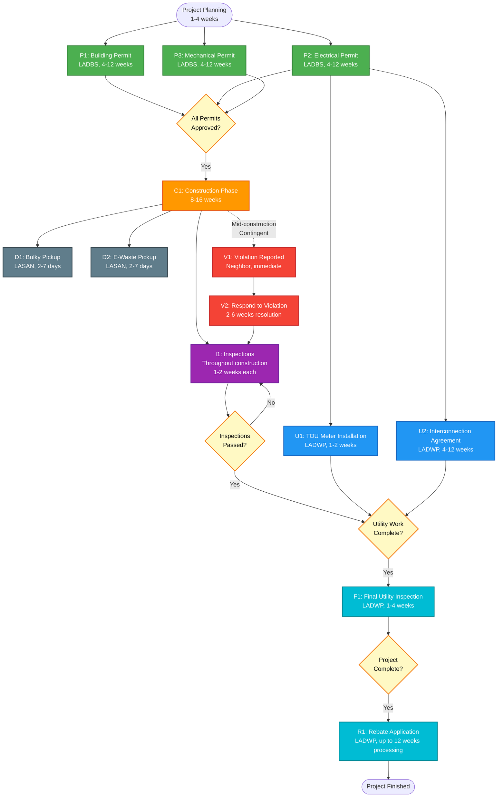

### Current Home Renovation Journey in Los Angeles: A Detailed Case Study

Citizens in Los Angeles face fragmented government services for home renovations, often navigating multiple agencies like the Los Angeles Department of Building and Safety (LADBS), Los Angeles Department of Water and Power (LADWP), and LA Sanitation & Environment (LASAN) with manual submissions, inconsistent timelines, and limited digital tracking. This results in delays, redundant paperwork, and unexpected costs, eroding efficiency and trust. Without streamlined coordination, such projects can drag on for months, straining resources and complicating compliance.

Let's follow John, a homeowner in Los Angeles, through the current process for their ambitious remodel: switching to a Time of Use (TOU) meter to better leverage off-hours cheaper power rates and maximize the benefits of solar batteries, replacing his outdated load center with a new smart electrical panel, rewiring the entire house, replacing a gas furnace and AC with ductless heat pumps, adding solar panels and batteries, and installing a full metal roof. John also needs to dispose of old materials like concrete roof tiles, the old electrical panel, furnace, AC unit, and electrical cables. Midway, a neighbor falsely reports a code violation about the heat pump unit. This narrative captures all government interaction points, based on official processes from LADBS, LADWP, LASAN, and related codes, highlighting steps, documents, timelines, and costs where available (note: actual times and fees vary by complexity, workload, and specifics; estimates drawn from 2025-2026 guidelines).

#### Phase 1: Project Inception and Planning (1-4 Weeks)
John starts by researching requirements and hiring licensed professionals—a general contractor, electrician (C-10 licensed), HVAC specialist, and solar installer—to avoid penalties for unpermitted work (fines up to $2,000+). No direct government interaction yet, but John reviews LADBS homeowner guides online for zoning compliance (e.g., via ladbs.org zoning tools) and California Energy Code (Title 24) for energy efficiency. John also researches LADWP's Time of Use (TOU) rate plans to understand how shifting energy usage to off-peak hours (especially with solar batteries) can significantly reduce electricity costs.

- **Key Steps**: Assess property (e.g., roof strength for solar, electrical load calculations per ACCA Manual J). Evaluate existing load center—John's 30-year-old 200A panel needs replacement to support solar/battery integration and enable smart load management. Prepare plans: site diagrams, electrical schematics with new smart panel specs, structural calculations for roof/heat pumps, equipment specs (e.g., heat pump HSPF ratings ≥8.2, solar inverter UL 1741 SA certified, smart panel with TOU-aware circuit management). Research TOU rate plans (e.g., TOU-D-PRIME) and battery charging strategies.
- **Documents**: Property address/APN, load calcs, equipment lists, existing panel photos/specs, new smart panel cutsheet (e.g., Span, Schneider Square D Smart Panel, or Leviton Load Center with energy monitoring).
- **Timeline**: 1-4 weeks for design.
- **Costs**: Professional fees ($5,000-$10,000 for plans/consulting required for permit applications); no government fees yet.
- **Pain Points**: Fragmented info across websites; no centralized guidance leads to revisions later.

#### Phase 2: Applying for Building Permits (4-12+ Weeks)
John submits to LADBS for multiple permits: electrical (smart panel replacement/rewiring/solar/batteries with TOU meter integration), mechanical (heat pumps), and building (roof). All require plan review due to complexity; no express permits apply for panel replacement or full rewiring.

- **Involved Agency**: LADBS (online via ePlanLA or in-person at centers like Metro or Van Nuys).
- **Steps**:
  1. Create Angeleno Account on ladbs.org.
  2. Submit separate applications: Electrical for smart load center replacement/rewiring/solar/batteries with TOU meter integration (requires plan check per LAMC 93.0201 for panel replacement and NEC Article 408 compliance); Mechanical for ductless heat pumps (e.g., min. efficiency 8.2 HSPF, refrigerant charge verification); Building for metal roof (structural calcs to ensure load-bearing).
  3. Upload docs: Site plans, load calcs, detailed panel schedules showing existing and new smart panel (with circuit-by-circuit listing, breaker ratings, and smart monitoring capabilities), equipment specs (e.g., smart panel UL 67 listed, heat pump COP ratings, solar fault currents, battery storage capacity optimized for TOU rate schedules), single-line diagrams showing panel location and service entrance, contractor licenses (C-10 electrical required).
  4. Pay fees and await review; respond to corrections (e.g., unclear diagrams).
  5. Receive approvals and post permit cards on-site.
- **Timeline**: Submission 1-3 days; review 4-12 weeks (longer for solar/batteries due to engineering checks); revisions add 1-4 weeks per round. Total: 4-12+ weeks.
- **Costs**: Electrical permit base $200-$600 (includes panel replacement); plan check 65% of permit fee; total ~$1,500-$3,000 for all permits (electrical, mechanical, building). Panel replacement adds ~$200-$400 to permit fees (valuation-based on $2,500-$4,000 panel cost). Solar-specific: Valuation-based on capacity.
- **Documents**: Plans/diagrams, calcs, specs, authorizations.
- **Government Interactions**: Online/in-person submissions; email/phone for clarifications. No unified portal for multi-permits.
- **Pain Points**: Separate apps for each trade; delays from backlogs; manual corrections without real-time feedback.

#### Phase 3: Utility Upgrades and Interconnections (4-12+ Weeks, Overlapping with Permits)
With LADBS approvals in hand, John coordinates with LADWP for the TOU meter installation, solar interconnection, and battery storage. This requires an Interconnection Agreement (IA) for renewables and a TOU rate enrollment to maximize off-peak charging benefits.

- **Involved Agency**: LADWP (contact PV/BESS Service Design Group at 213-367-6163 or SolarCoordinator@ladwp.com).
- **Steps**:
  1. Enroll in TOU rate plan online via ladwp.com (e.g., TOU-D-PRIME for residential solar customers) and request TOU meter installation.
  2. Submit Service Planning Info sheet and request IA via ladwp.com/NEM.
  3. Provide data: Single-line diagrams, equipment specs (e.g., battery UL 9540 certified, solar IEEE 1547 compliant), fault currents, battery charging/discharging schedule optimized for TOU periods.
  4. LADWP reviews/issues requirements (e.g., visible disconnects, TOU-compatible smart metering).
  5. Pay fees; LADWP schedules TOU meter swap.
  6. Install on-site (TOU meter, solar equipment, battery system); obtain LADBS inspections.
  7. Final LADWP inspection; energize and activate TOU billing with net metering for solar/batteries.
- **Timeline**: TOU enrollment immediate online; IA request 1-2 weeks; engineering 4-6 weeks; TOU meter installation 1-2 weeks; inspections 1-2 weeks. Total: 4-12+ weeks.
- **Costs**: TOU enrollment free; Application/engineering fees ~$500-$2,000; TOU meter installation typically $0-$200.
- **Documents**: Plans, specs, protective schemes.
- **Government Interactions**: Email/phone submissions; on-site inspections. Must align with LADBS permits.
- **Pain Points**: Separate from LADBS; delays if docs mismatch; no automated status updates.

#### Phase 4: Construction and Inspections (8-16 Weeks)
With permits and utility approvals, John's contractors proceed in phases: roof rebuild first (to support solar), then smart load center installation and electrical rewiring, heat pump install, solar/batteries last. The new smart panel enables real-time circuit monitoring and can automatically shed non-essential loads during peak TOU periods. John programs the battery system to charge during off-peak TOU hours when rates are lowest (e.g., 8 PM - 4 PM), maximizing cost savings.

- **Steps**: 
  - **Electrical rough inspection** (after old panel removal, new panel mounting, rough wiring/conduits before walls close): LADBS inspector verifies proper panel installation per NEC 408.3 (enclosure integrity), 408.4 (grounding), proper torque on all connections, adequate working clearances per NEC 110.26 (3-ft clearance, 30-inch width), correct breaker ratings, and smart panel compatibility with solar/battery backfeed per NEC 705.12.
  - **Electrical final inspection** (after all circuits connected, smart panel commissioned): Verify proper labeling (NEC 408.4), arc-fault protection (NEC 210.12), GFCI protection where required (NEC 210.8), panel schedule matches as-built, smart monitoring functions operational, and integration with TOU meter.
  - For heat pumps: Verify refrigerant charge, airflow ≥350 CFM/ton, insulation. 
  - Solar/batteries: Test per IEEE 1547.1; HERS rater for efficiency verification. 
  - Configure battery management system and smart panel for TOU optimization with automated load shedding.
- **Timeline**: 8-16 weeks (phased to avoid weather/delays); inspections scheduled via 311 (days to 2 weeks). Panel replacement adds 1-2 days to electrical work.
- **Costs**: Re-inspection fees $100-$200 each (if failed).
- **Government Interactions**: Multiple LADBS/LADWP site visits; manual scheduling.
- **Pain Points**: Coordination between agencies; fails (e.g., improper sizing) add weeks/fees.

#### Phase 5: Material Disposal (Ongoing, 1-7 Days per Pickup)
During demo, John disposes of old roof tiles (construction debris), old electrical panel/breakers, furnace/AC (appliances), and cables (e-waste).

- **Involved Agency**: LASAN (call 311 or use MyLA311 app).
- **Steps**:
  1. Schedule bulky pickup for furnace/AC (accepted as appliances; Freon handled by LASAN).
  2. Place items curbside by 6 AM on collection day.
  3. For cables and old electrical panel/breakers: Call 311 for e-waste curbside (electrical panels contain recyclable metals and are accepted as e-waste; separate from bulky limit).
  4. Roof tiles/debris: Not accepted (construction waste); haul to landfill (e.g., via private service like Junkluggers) or drop at S.A.F.E. Centers (limited quantities, weekends 9 AM-3 PM).
- **Timeline**: Schedule 2-7 business days; up to 10 collections/year (10 items each).
- **Costs**: Free for bulky/e-waste (government service).
- **Documents**: None; provide item list when scheduling.
- **Government Interactions**: Phone/app requests; no tracking beyond confirmation.
- **Pain Points**: Limited acceptance (no debris); separate channels for e-waste.

#### Phase 6: Handling the Code Violation Report (2-6 Weeks)
Mid-construction, a neighbor falsely reports the heat pump outdoor unit as too close to the property line and noisy (violating setbacks/noise codes, e.g., LAMC Sec. 112.01 noise limits).

- **Involved Agency**: LADBS Code Enforcement (report via 311 or ladbs.org form).
- **Steps** (Neighbor): Submit complaint online/phone with details/address/photos.
- **Steps (Investigation)**: LADBS assigns inspector (days to weeks); site visit to check compliance (e.g., heat pump setbacks per zoning, noise <50 dBA).
- **Steps (John)**: Receives notice (mail/email); provides evidence (permits, plans showing compliance, e.g., unit 5+ ft from line, low-noise model).
- **Resolution**: Inspector verifies invalid (no violation); case closed. If valid, order to comply (fixes within 30-60 days, fines $350+).
- **Timeline**: Report to inspection 1-3 weeks; resolution 1-3 weeks (total 2-6 weeks).
- **Costs**: None for John (invalid); potential fines if valid.
- **Documents**: Complaint form (neighbor); permits/proof (John).
- **Government Interactions**: 311 reporting; mail notices; phone/email follow-ups.
- **Pain Points**: No proactive notifications; manual evidence submission; delays halt work.

# Phase 7: Project Completion (1-4 Weeks + Rebate Processing)

Citizens expect seamless digital-first government services, yet fragmented processes across agencies often extend project timelines and delay financial benefits like rebates. In this final phase, outdated manual submissions and limited tracking for incentives contribute to uncertainty, while AI-powered portals could automate rebate eligibility checks, guide applications, and provide real-time status updates for a more responsive experience.

With construction wrapped up, John proceeds to final approvals and applies for the LADWP Consumer Rebate Program (CRP) incentive for the ductless heat pump HVAC installation—a key efficiency upgrade in the remodel. The TOU meter is now active, and John's battery system automatically charges during super off-peak hours (8 PM - 4 PM weekdays, all weekend) when rates are lowest, and discharges during on-peak hours (4 PM - 9 PM weekdays) to avoid the highest rates, maximizing solar investment returns.

### Key Steps
- **Final Inspections and Approvals (1-4 Weeks)**:  
  LADBS conducts final inspections for all permitted work (roof, electrical rewiring, heat pumps, solar/batteries). LADWP performs its final utility inspection, energizes the upgraded service, and issues Permission to Operate (PTO) for the solar panels and battery system. A certificate of occupancy may be issued if required for major structural changes.

- **Rebate Application for Efficient Ductless Heat Pumps (Post-Completion)**:  
  John applies for the LADWP CRP rebate, which supports energy-efficient heat pump HVAC systems (including ductless mini-split and multi-split). As of January 2026 (for equipment purchased/installed on or after November 1, 2025), qualifying systems are eligible for up to **$2,500 per ton** based on SEER2/HSPF2 ratings and capacity. (For a typical whole-home ductless setup, this could yield several thousand dollars, offsetting costs significantly.)

  - **When to File**: After full installation, final inspections, and approvals—proof of compliant installation is required.
  - **Required Documents**: 
    - Copy of LADWP bill (now showing TOU rate plan enrollment)
    - Paid itemized invoice (with make, model, and tonnage)
    - AHRI Certificate of Product Rating (verifying efficiency ratings)
    - Final approved LADBS mechanical permit
  - **How to Apply**: Online via ladwp.com/crp (log in and upload documents) or by mail (complete CRP form and send with copies). Application must be submitted/postmarked within 12 months of equipment purchase date.
  - **How to Track**: Receive confirmation upon submission (email for online). Status checked via LADWP customer service (1-800-DIAL-DWP or crp@ladwp.com); no dedicated online tracking portal mentioned—manual follow-ups may be needed. LADWP may conduct a verification inspection.
  - **When Obtained**: Processing typically up to 12 weeks (3 months); rebate issued as a mailed check once approved.

**TOU Rate Benefits**: With the new TOU meter and solar batteries, John can expect to save an additional 30-50% on electricity costs compared to standard residential rates by charging batteries during off-peak periods (rates as low as $0.15/kWh) and avoiding on-peak periods (rates up to $0.45/kWh). The battery system provides automatic optimization based on TOU rate schedules.

### Timeline
- Inspections and PTO: 1-4 weeks
- Rebate processing: Up to 12 weeks after submission

### Costs/Savings
- No additional government fees for final inspections (included in prior permit fees)
- Rebate: Up to $2,500 per ton (potential $5,000–$10,000+ for multi-ton system)

This phase highlights lingering fragmentation: even incentives require separate post-project efforts with manual tracking. By deploying AI-driven virtual assistants, agencies could proactively notify residents of eligible rebates during permitting, pre-fill applications from shared data, recommend TOU rate plans with cost projections, and deliver instant status updates—fostering faster access to savings, reduced overhead, and stronger trust in public services.

This journey illustrates disconnected services: John juggles 20+ interactions across agencies, with months of delays from manual reviews and uncoordinated timelines.  Next, we can explore AI re-engineering for efficiency, like virtual assistants guiding unified applications, TOU rate optimization recommendations, battery charging schedules, and real-time updates.

# Agency Interactions in Home Renovation Process

## Summary Table (Chronological Order with Dependencies, Timelines, and Costs)

This table organizes the processes in approximate chronological order based on the renovation journey, showing dependencies between tasks. Timelines and costs are typical estimates as of early 2026, drawn from LADBS, LADWP, and LASAN guidelines; actuals vary by project complexity, workload, and specifics (e.g., valuation-based fees).

| ID | Persona  | Agency | Process Engaged | Dependencies | Typical Completion Time | Associated Costs (Approximate) |
|----|----------|--------|-----------------|--------------|-------------------------|--------------------------------|
| P1 | John | LADBS | Building Permit Application (for metal roof) | None | 4-12 weeks (plan check review + revisions) | $500-$1,500 (valuation-based + plan check) |
| P2 | John | LADBS | Electrical Permit Application (for smart panel replacement, rewiring, solar, batteries with TOU integration) | None | 4-12 weeks (concurrent with P1, P3) | $800-$1,800 (includes panel replacement valuation) |
| P3 | John | LADBS | Mechanical Permit Application (for heat pumps) | None | 4-12 weeks (concurrent with P1, P2) | $400-$1,000 |
| U1 | John | LADWP | TOU Rate Plan Enrollment and TOU Meter Installation Request | P2 submitted | 1-2 weeks (enrollment immediate, meter swap scheduled) | $0-$200 (meter swap) |
| U2 | John | LADWP | Interconnection Agreement Application (for solar panels and batteries with TOU optimization) | P2 submitted | 4-12 weeks (review + requirements, concurrent with U1) | $500-$2,000 (application/engineering) |
| C1 | John | LADBS | Construction Phase (contractors begin work) | P1, P2, P3 approved | 8-16 weeks | N/A (contractor costs excluded) |
| I1 | John | LADBS | Rough and Final Inspections (for all permitted work) | C1 in progress | 1-2 weeks per scheduling (multiple over 8-16 weeks) | $100-$200 per re-inspection if failed |
| D1 | John | LASAN | Bulky Item Pickup Scheduling (for old furnace, AC unit) | C1 started (during demolition) | 2-7 days scheduling + pickup | Free (up to 10 collections/year) |
| D2 | John | LASAN | E-Waste Curbside Collection Request (for old electrical panel, breakers, cables) | C1 started (during demolition) | 2-7 days scheduling + pickup | Free |
| V1 | Neighbor | LADBS | Code Violation Reporting (alleged heat pump setback/noise issues) | C1 in progress (mid-construction) | Immediate submission; investigation starts 1-3 weeks | $0 (for reporter) |
| V2 | John | LADBS | Response to Code Violation Notice (provide evidence of compliance) | V1 filed | 2-6 weeks total resolution | $0 (if invalid; potential fines if valid) |
| F1 | John | LADWP | Final Utility Inspection and TOU Meter Activation | C1 complete, I1 passed, U1 and U2 approved | 1-4 weeks (after on-site install) | Included in prior fees |
| R1 | John | LADWP | Rebate Application for Efficient HVAC (Ductless Heat Pumps) | F1 complete, I1 passed | Submission immediate after completion; processing up to 12 weeks | $0 (rebate received: $1,500-$2,500 per ton) |

**Legend:**
- **P#**: Permit applications (can run in parallel)
- **U#**: Utility coordination (depends on permit submissions)
- **C#**: Construction phase
- **I#**: Inspections (throughout construction)
- **D#**: Disposal/waste management (during construction, parallel)
- **V#**: Violation handling (contingent event)
- **F#**: Final approvals
- **R#**: Rebates (post-completion)

## Process Dependency Flow Chart

The following diagram shows the dependencies and parallel execution paths for John's home renovation project with TOU meter installation. Tasks at the same horizontal level can be executed in parallel.

## Key Observations from Dependency Analysis

### Critical Path
The longest dependency chain (critical path) runs through:
1. **Electrical Permit (P2)**: 4-12 weeks
2. **Utility Coordination (U2 - Interconnection Agreement)**: 4-12 weeks (starts after P2 submitted, runs parallel with faster U1 TOU meter installation)
3. **Construction (C1)**: 8-16 weeks (waits for all permits approved)
4. **Inspections (I1)**: Throughout construction
5. **Final Utility Inspection (F1)**: 1-4 weeks
6. **Rebate Processing (R1)**: Up to 12 weeks

**Total Critical Path**: ~21-56+ weeks (5-14 months)

### Parallelization Opportunities
- **Permit Applications (P1, P2, P3)**: Can all be submitted simultaneously, saving 8-24 weeks vs. sequential
- **Utility Requests (U1 TOU meter, U2 interconnection)**: Can start as soon as electrical permit is submitted (don't need to wait for approval); TOU meter installation (1-2 weeks)
- **Disposal Activities (D1, D2)**: Run independently during construction, no blocking
- **Violation Handling (V1, V2)**: Contingent path that can delay construction by 2-6 weeks if triggered

### Bottlenecks Identified
1. **Permit Review Delays**: 4-12 weeks review time with potential for 1-4 week revision rounds
2. **Interconnection Agreement Processing**: 4-12 weeks for solar/battery systems (TOU meter installation takes 1-2 weeks)
3. **Agency Coordination**: No automated handoffs between LADBS (permits) and LADWP (utility work); TOU rate optimization not proactively suggested during planning phase
4. **Inspection Scheduling**: 1-2 week delays per inspection, compounded by potential failures
5. **Manual Status Tracking**: Citizens must proactively check status across 3+ agency systems; no integrated view of TOU savings potential

### AI-Powered Improvements
With the MCP-based architecture, the system can:
- **Parallel Submission**: Auto-submit all permit applications simultaneously with pre-validation
- **Proactive Coordination**: Trigger utility requests immediately upon permit submission (not approval)
- **TOU Rate Optimization**: Recommend TOU rate plans during planning phase based on solar/battery configuration, provide cost savings projections comparing standard vs. TOU rates
- **Predictive Timeline**: Use historical data to provide accurate estimates and identify delay risks early
- **Automated Tracking**: Monitor all processes across agencies and proactively notify citizens of status changes
- **Smart Scheduling**: Optimize inspection sequences to minimize delays and coordinate across agencies
- **Battery Charging Optimization**: Auto-configure battery systems based on enrolled TOU rate schedules for maximum savings; provide real-time monitoring of charging patterns
- **Early Rebate Identification**: Alert citizens to rebate eligibility during permit phase, not after completion
- **Cost-Benefit Analysis**: Provide TOU rate plan savings projections based on usage patterns and solar/battery configuration
