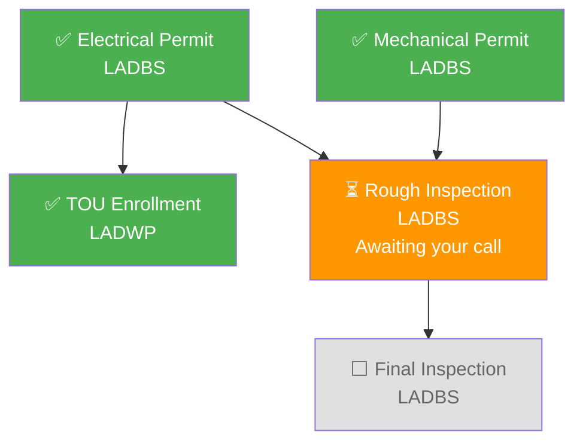

# Citizen Services Portal - Architecture Review v2

## Purpose of This Document

This document reviews and refines the architecture from [4-architecture.md](4-architecture.md), focusing on:
1. Single orchestrator agent with per-agency MCP tools
2. Agency knowledge bases stored as repo assets, indexed into AI Search (one index per agency)
3. Simple MCP tools that either execute or delegate to user. Handling manual/offline processes with user task assignment
4. Chat-first UI with plan widget sidebar

---

## Design Principles (Refined)

1. **One Agent, Many Tools**: Single orchestrator agent invokes MCP tools across agencies
2. **Agency Independence**: Each agency has own MCP server + knowledge index, scales independently
3. **Project-Centric**: UI organized around projects; each project has one plan tracking the journey
4. **Graceful Delegation**: Tools either execute (automated) or delegate to user with prepared materials
5. **Knowledge-Grounded**: Agent uses indexed agency documents stored as repo assets
6. **Simple Tool Contract**: No manifest abstraction - tools just do work or return "user action needed"

---

## Simplified Story-Line (Demo Scope)

Based on [3-demo-story-line.md](3-demo-story-line.md), **dropping the violation sub-plot** for simplicity.

John's journey involves **3 agencies**:

| Agency | Key Processes | Current Method |
|--------|--------------|----------------|
| **LADBS** | Building/Electrical/Mechanical permits, Inspections | Online (ePlanLA), 311 |
| **LADWP** | TOU meter enrollment, Interconnection Agreement, Rebates | Online + Email |
| **LASAN** | Bulky item pickup, E-waste collection | 311 / MyLA311 app |

### Simplified Interaction Flow (Chronological)

| ID | Agency | Process | Automation Level | Notes |
|----|--------|---------|------------------|-------|
| P1 | LADBS | Electrical Permit Application | **Automated** | Submit via ePlanLA API |
| P2 | LADBS | Mechanical Permit Application | **Automated** | Submit via ePlanLA API |
| P3 | LADBS | Building Permit Application | **Automated** | Submit via ePlanLA API |
| U1 | LADWP | TOU Rate Enrollment | **Automated** | Online enrollment |
| U2 | LADWP | Interconnection Agreement | **User Action** | Prepare docs, user emails |
| I1 | LADBS | Schedule Inspections | **User Action** | Prepare request, user calls 311 |
| D1 | LASAN | Bulky Item Pickup | **User Action** | User schedules via 311/app |
| D2 | LASAN | E-waste Pickup | **User Action** | User schedules via 311/app |
| F1 | LADWP | Final Inspection + PTO | **User Action** | Coordination step |
| R1 | LADWP | Rebate Application | **Automated** | Submit via CRP portal |

**Key simplification:** 4 automated steps, 6 user-action steps. No violation handling.

---

## Core Architecture Components

### 1. Agency Knowledge Architecture

**Problem:** Agent needs to understand agency processes, requirements, timelines, fees.

**Solution:** 
- Collect required documents for the story-line
- Store as assets in this repository (`/docs/knowledge/{agency}/`)
- Build ingestion pipeline to index into Azure AI Search
- One index per agency

#### Knowledge Storage & Ingestion

```
Repository Assets                 Ingestion Pipeline           Azure AI Search
(/docs/knowledge/)                                             (One index per agency)
       │                               │                              │
       ▼                               ▼                              ▼
┌─────────────────┐           ┌──────────────────┐          ┌─────────────────┐
│ /ladbs/         │           │                  │          │ ladbs-docs      │
│  • permits.pdf  │ ────────► │  Document        │ ───────► │  • chunks       │
│  • fees.pdf     │           │  Intelligence    │          │  • embeddings   │
│  • codes.md     │           │                  │          │  • metadata     │
└─────────────────┘           │  • Parse docs    │          └─────────────────┘
                              │  • Chunk text    │
┌─────────────────┐           │  • Generate      │          ┌─────────────────┐
│ /ladwp/         │ ────────► │    embeddings    │ ───────► │ ladwp-docs      │
│  • tou-rates.pdf│           │  • Index to      │          └─────────────────┘
│  • crp-rebate.md│           │    AI Search     │
│  • ia-process.md│           │                  │          ┌─────────────────┐
└─────────────────┘           │                  │ ───────► │ lasan-docs      │
                              │                  │          └─────────────────┘
┌─────────────────┐           │                  │
│ /lasan/         │ ────────► │                  │
│  • pickup.md    │           └──────────────────┘
│  • ewaste.md    │
└─────────────────┘
```

#### How Agent Uses Knowledge

Each MCP server exposes a `queryKB` tool that searches its agency's index:

```python
# Agent needs to know permit requirements
# Calls LADBS MCP server's queryKB tool

results = await ladbs_mcp.queryKB(
    query="What documents do I need for an electrical permit with solar panels?",
    top=5
)

# Returns relevant chunks from ladbs-docs index
# Agent synthesizes response from retrieved content
```

**Key Insight:** Knowledge stays per-agency. Each MCP server owns its knowledge tool. Agent doesn't access AI Search directly.

---

### 2. MCP Tool Design: Simple Execute-or-Delegate Pattern

**Principle:** No manifest abstraction. Tools are straightforward:
- **Automated tools**: Gather required input, execute action, return result
- **User-action tools**: Gather context, prepare materials, return delegation to user

#### Tool Behavior Pattern

```
┌─────────────────────────────────────────────────────────────────┐
│                    MCP TOOL EXECUTION FLOW                      │
├─────────────────────────────────────────────────────────────────┤
│                                                                 │
│  AUTOMATED TOOL (e.g., permits.submit)                          │
│  ────────────────────────────────────                           │
│  1. Tool is called with partial info                            │
│  2. Tool asks for any missing required inputs                   │
│  3. Tool executes against backend API                           │
│  4. Tool returns result (permit number, status, etc.)           │
│                                                                 │
│  USER-ACTION TOOL (e.g., inspections.schedule)                  │
│  ────────────────────────────────────────────                   │
│  1. Tool is called with context (permit number, address)        │
│  2. Tool gathers any additional needed info                     │
│  3. Tool prepares materials for user:                           │
│     • Phone script for 311 call                                 │
│     • Email draft with attachments                              │
│     • Checklist of what to have ready                           │
│  4. Tool returns:                                               │
│     {                                                           │
│       "requiresUserAction": true,                               │
│       "actionType": "phone_call",                               │
│       "target": "311",                                          │
│       "preparedMaterials": [...],                               │
│       "instructions": "...",                                    │
│       "onComplete": "Tell me the scheduled date and conf #"     │
│     }                                                           │
│                                                                 │
└─────────────────────────────────────────────────────────────────┘
```

#### Example: Automated Tool Response

```json
// permits.submit successful response
{
  "success": true,
  "permitNumber": "2026-001234",
  "status": "submitted",
  "estimatedReviewTime": "4-6 weeks",
  "fees": {
    "planCheck": 450.00,
    "permit": 800.00,
    "total": 1250.00
  },
  "nextSteps": "You'll receive email updates. Check status anytime."
}
```

#### Example: User-Action Tool Response

```json
// inspections.schedule response (not automated)
{
  "requiresUserAction": true,
  "actionType": "phone_call",
  "target": "311",
  "reason": "LADBS inspection scheduling is only available via phone",
  
  "preparedMaterials": {
    "phoneScript": "Call 311 and say: 'I need to schedule a rough electrical inspection for permit #2026-001234 at 123 Main St, Los Angeles. My name is John Smith, phone 555-0123.'",
    "checklist": [
      "Have permit number ready: 2026-001234",
      "Work must be ready for inspection (wiring complete, accessible)",
      "Request morning slot if possible"
    ],
    "contactInfo": {
      "phone": "311",
      "hours": "24/7"
    }
  },
  
  "onComplete": {
    "prompt": "Once scheduled, please tell me the inspection date and confirmation number",
    "expectedInfo": ["scheduled_date", "confirmation_number"]
  }
}
```

---

### 3. MCP Server Specifications

Each MCP server is a standalone service exposing tools for its agency. Below are the mini-specs defining each server and its tools.

---

#### 3.1 LADBS MCP Server

**Purpose:** Los Angeles Department of Building and Safety - Permits and Inspections

**Base URL:** `https://mcp-ladbs.{environment}.azurecontainerapps.io`

| Tool | Type | Action | Key Inputs | Returns |
|------|------|--------|------------|---------|
| `queryKB` | Query | Search LADBS docs index | `query: string`, `top?: number` | Relevant document chunks |
| `permits.search` | Query | Find existing permits | `address: string` or `permitNumber: string` | List of permits with status |
| `permits.submit` | **Automated** | Submit permit application | `permitType`, `address`, `applicant`, `documents[]` | `permitNumber`, status, fees |
| `permits.getStatus` | **Automated** | Check permit status | `permitNumber: string` | Status, approvalDate, nextSteps |
| `inspections.scheduled` | Query | View scheduled inspections | `permitNumber` or `address` | Scheduled inspections with dates, types, status |
| `inspections.schedule` | **User Action** | Prepare inspection request | `permitNumber`, `inspectionType` | Phone script, checklist for 311 call |

**Permit Types:** `electrical`, `mechanical`, `building`, `plumbing`

**Inspection Types:** `rough_electrical`, `final_electrical`, `rough_mechanical`, `final_mechanical`, `framing`, `final`

---

#### 3.2 LADWP MCP Server

**Purpose:** Los Angeles Department of Water and Power - Utility Services, Solar, Rebates

**Base URL:** `https://mcp-ladwp.{environment}.azurecontainerapps.io`

| Tool | Type | Action | Key Inputs | Returns |
|------|------|--------|------------|---------|
| `queryKB` | Query | Search LADWP docs index | `query: string`, `top?: number` | Relevant document chunks |
| `account.show` | Query | Get current account info | `accountNumber: string` | Current rate plan, meter type, pending requests |
| `plans.list` | Query | List available LADWP rate plans | `accountNumber` | Available plans (standard and TOU) with rates |
| `tou.enroll` | **Automated** | Enroll in TOU rate plan | `accountNumber`, `ratePlan: enum` | Confirmation, effective date |
| `interconnection.submit` | **User Action** | Prepare IA application | `systemSize`, `equipmentSpecs`, `address` | Email draft, required docs, submission instructions |
| `interconnection.getStatus` | Query | Check IA application status | `applicationId` or `address` | Status, next steps, PTO date if approved |
| `rebates.filed` | Query | List filed rebate applications | `accountNumber: string` | All rebate applications with IDs, status, amounts |
| `rebates.apply` | **Automated** | Submit CRP rebate | `accountNumber`, `equipmentType`, `invoices[]`, `ahriCert` | Application ID, estimated amount |
| `rebates.getStatus` | **Automated** | Track rebate status | `applicationId: string` | Status, estimatedPayout, timeline |

**TOU Rate Plans:** `TOU-D-A`, `TOU-D-B`, `TOU-D-PRIME` (solar customers)

**Equipment Types (Rebates):** `heat_pump_hvac`, `heat_pump_water_heater`, `smart_thermostat`

---

#### 3.3 LASAN MCP Server

**Purpose:** LA Sanitation & Environment - Waste Collection and Disposal

**Base URL:** `https://mcp-lasan.{environment}.azurecontainerapps.io`

| Tool | Type | Action | Key Inputs | Returns |
|------|------|--------|------------|---------|
| `queryKB` | Query | Search LASAN docs index | `query: string`, `top?: number` | Relevant document chunks |
| `pickup.scheduled` | Query | View scheduled pickups | `address: string` | Scheduled pickups with dates, items, status |
| `pickup.schedule` | **User Action** | Prepare pickup request | `pickupType: enum`, `items[]`, `address` | 311 script, scheduling instructions |
| `pickup.getEligibility` | Query | Check pickup eligibility | `address`, `itemTypes[]` | Eligible items, limits, alternatives |

**Pickup Types:** `bulky_item`, `ewaste`, `hazardous`

**Item Categories:** `appliances`, `furniture`, `electronics`, `construction_debris` (not accepted - returns alternatives)

---

#### 3.4 Reporting MCP Server

**Purpose:** Track step durations for reporting and surface average times to users

**Base URL:** `https://mcp-reporting.{environment}.azurecontainerapps.io`

| Tool | Type | Action | Key Inputs | Returns |
|------|------|--------|------------|--------|
| `steps.logCompleted` | **Automated** | Log a completed step for reporting | `toolName`, `city`, `startedAt`, `completedAt` | Confirmation |
| `steps.getAverageDuration` | Query | Get average duration for step type | `toolName`, `city?` | Average days, sample count |

**How it works:**

1. When agent completes a plan step, it calls `steps.logCompleted` with:
   - `toolName`: The MCP tool used (e.g., `permits.submit`, `tou.enroll`)
   - `city`: Geographic filter (e.g., `Los Angeles`)
   - `startedAt` / `completedAt`: Timestamps from the step

2. When building a plan or answering "how long will this take?", agent calls `steps.getAverageDuration`:
   - Returns average duration based on last 6 months of data
   - Filtered by city for local relevance

**Normalized Step Names (toolName values):**

Step names are normalized to MCP tool names for consistent aggregation:

| toolName | Description |
|----------|-------------|
| `permits.submit` | Permit application (any type) |
| `permits.getStatus` | Permit status check |
| `inspections.schedule` | Schedule an inspection |
| `tou.enroll` | TOU rate enrollment |
| `interconnection.submit` | Solar interconnection application |
| `rebates.apply` | Rebate application |
| `pickup.schedule` | Waste pickup scheduling |

**Example usage:**

```
Agent: "Based on recent data in Los Angeles, electrical permits 
        typically take 6-8 weeks from submission to approval."
        
        [calls steps.getAverageDuration with toolName="permits.submit", city="Los Angeles"]
        → { "averageDays": 47, "sampleCount": 234 }
```

---

#### 3.5 Tool Summary

| Server | Total Tools | Automated | User Action | Query |
|--------|-------------|-----------|-------------|-------|
| LADBS | 6 | 2 | 1 | 3 |
| LADWP | 9 | 3 | 1 | 5 |
| LASAN | 4 | 0 | 1 | 3 |
| Reporting | 2 | 1 | 0 | 1 |
| **Total** | **21** | **6** | **3** | **12** |

---
#### 3.6 Tool Coverage Validation

This section validates that the 19 tools cover all story-line interactions and natural conversation patterns.

##### Story-Line Coverage

| Story Step | Agency | Action | Tool | ✓ |
|------------|--------|--------|------|---|
| P1 | LADBS | Building Permit (roof) | `permits.submit` | ✓ |
| P2 | LADBS | Electrical Permit (panel, solar, battery) | `permits.submit` | ✓ |
| P3 | LADBS | Mechanical Permit (heat pumps) | `permits.submit` | ✓ |
| U1 | LADWP | TOU Rate Enrollment | `tou.enroll` | ✓ |
| U2 | LADWP | Interconnection Agreement | `interconnection.submit` | ✓ |
| I1 | LADBS | Schedule Inspections | `inspections.schedule` | ✓ |
| D1 | LASAN | Bulky Item Pickup | `pickup.schedule` | ✓ |
| D2 | LASAN | E-waste Pickup | `pickup.schedule` | ✓ |
| F1 | LADWP | Final Inspection + PTO | `interconnection.getStatus` | ✓ |
| R1 | LADWP | Rebate Application | `rebates.apply` | ✓ |

##### Natural Conversation Coverage

| User Question | Tool(s) Used | Notes |
|---------------|--------------|-------|
| "What permits do I need for solar?" | `queryKB` (LADBS) | Agent learns requirements from indexed docs |
| "Have I filed anything at this address?" | `permits.search` | Lists existing permits by address |
| "What's my permit status?" | `permits.getStatus` | Returns status, approval date, next steps |
| "When's my inspection?" | `inspections.scheduled` | Lists scheduled inspections |
| "What rate plan am I on?" | `account.show` | Shows current plan + pending requests |
| "What TOU plans are available?" | `plans.list` | Lists all LADWP rate plans with rates |
| "Did my TOU switch go through?" | `account.show` | Current plan reflects completed enrollment |
| "What's my interconnection status?" | `interconnection.getStatus` | Status, next steps, PTO date |
| "Have I gotten PTO yet?" | `interconnection.getStatus` | PTO date if approved |
| "Where's my rebate?" | `rebates.filed` → `rebates.getStatus` | List first, then check specific status |
| "What rebates have I filed?" | `rebates.filed` | All applications with IDs and status |
| "What pickups are scheduled?" | `pickup.scheduled` | Lists pickups with dates |
| "Can you pick up my roof tiles?" | `pickup.getEligibility` | Returns no + alternatives |
| "How do I get a heat pump rebate?" | `queryKB` (LADWP) | Agent learns requirements from docs |

##### Design Pattern: List → Detail

For entities with IDs (permits, rebates, inspections, pickups), the tool design follows a consistent pattern:

1. **List/Search** - Find entities by address/account (no ID needed)
2. **Get Status** - Get details by specific ID (from list results)

This enables natural conversation where the user doesn't need to know IDs:

```
User: "Where's my rebate?"
Agent: [calls rebates.filed with accountNumber]
        "I see you filed a heat pump rebate on Jan 15 (CRP-2026-1234). 
         Let me check the status..."
        [calls rebates.getStatus with applicationId]
        "It's currently in review. Estimated payout: $5,000. 
         Should be processed within 8 weeks."
```

---
### 4. User Task Tracking: Prepare → Assign → Track → Verify

When a tool returns `requiresUserAction: true`, the agent:

1. **Prepares**: Shows user the prepared materials (script, checklist, email draft)
2. **Assigns**: Adds step to plan as "awaiting_user_action"  
3. **Tracks**: When user returns, agent asks about pending tasks (passive check-in)
4. **Verifies**: User provides confirmation, agent updates plan

#### User Experience Flow

```
Agent: "Great, your electrical permit was approved! 🎉 
        
        Next: Schedule the rough electrical inspection.
        
        This requires a phone call to 311. Here's what to do:
        
        📞 Call: 311
        📋 Say: 'I need to schedule a rough electrical inspection 
           for permit #2026-001234 at 123 Main St'
        
        Have ready:
        ✓ Permit number: 2026-001234
        ✓ Your phone: 555-0123
        ✓ Work should be ready (wiring complete, accessible)
        
        Once scheduled, let me know the date and confirmation number!"

[User returns to chat later]

Agent: "Welcome back, John! I see you have a pending task: 
        scheduling your electrical inspection. 
        Were you able to call 311?"

User: "Yes! Scheduled for Feb 15, confirmation INS-789456"

Agent: "Perfect! ✅ I've updated your plan.
        
        Inspection scheduled: Feb 15, 2026 (INS-789456)
        
        I'll check in after Feb 15 to see how it went. 
        In the meantime, let's look at your next steps..."
```

---

### 5. Plan Data Model

Each project has one plan. Plans track the multi-step journey across agencies.

#### Plan Schema

```json
{
  "projectId": "prj-john-renovation-2026",
  "status": "active",
  "createdAt": "2026-01-15T10:00:00Z",
  "updatedAt": "2026-02-01T14:30:00Z",
  
  "citizen": {
    "id": "citizen-123",
    "name": "John Smith"
  },
  
  "project": {
    "title": "Home Renovation - 123 Main St",
    "type": "home_renovation",
    "description": "Solar panels, battery, heat pumps, metal roof",
    "property": {
      "address": "123 Main St, Los Angeles, CA 90012"
    }
  },
  
  "phases": [
    {
      "id": "permits",
      "name": "Permit Applications",
      "status": "completed",
      "steps": [
        {
          "id": "P1",
          "title": "Electrical Permit",
          "agency": "LADBS",
          "status": "completed",
          "result": {
            "permitNumber": "2026-001234",
            "approvedAt": "2026-01-28"
          }
        }
      ]
    },
    {
      "id": "construction",
      "name": "Construction & Inspections",
      "status": "in_progress",
      "steps": [
        {
          "id": "I1",
          "title": "Rough Electrical Inspection",
          "agency": "LADBS",
          "status": "awaiting_user_action",
          "userTask": {
            "type": "phone_call",
            "target": "311",
            "assignedAt": "2026-02-01",
            "preparedMaterials": { ... }
          }
        }
      ]
    }
  ],
  
  "summary": {
    "totalSteps": 10,
    "completed": 4,
    "awaitingUser": 2,
    "notStarted": 4
  },
  
  "references": {
    "permits": {
      "electrical": "2026-001234",
      "mechanical": "2026-001235"
    }
  },
  
  "conversationHistory": [
    // Stored for read-only completed projects
  ]
}
```

#### Project Lifecycle

```
┌──────────────┐     ┌──────────────┐
│   ACTIVE     │ ──► │  COMPLETED   │
│              │     │  (read-only) │
│ • Plan edits │     │ • View only  │
│ • Chat open  │     │ • Full hist. │
│ • Tasks due  │     │ • Reference  │
└──────────────┘     └──────────────┘
        │
        ▼
┌──────────────┐
│  CANCELED    │
│  (read-only) │
│ • View only  │
│ • Full hist. │
└──────────────┘
```

---

### 6. UI Design: Chat + Plan Sidebar

**Layout:** Two-panel design with project context.

```
┌─────────────────────────────────────────────────────────────────────────────┐
│  CITIZEN SERVICES PORTAL          Home Renovation - 123 Main St   John ▼   │
├────────────────────────────────────────────────┬────────────────────────────┤
│                                                │                            │
│  💬 CHAT                                       │  📋 PROJECT PLAN           │
│  ─────────────────────────────────────────     │  ────────────────────────  │
│                                                │                            │
│  Agent: Welcome back, John! I see you have     │  Progress: ████████░░ 60%  │
│  2 pending tasks. Were you able to call 311    │                            │
│  to schedule the inspection?                   │  ✅ Permits                 │
│                                                │     ✅ Electrical - Done    │
│  User: Yes! Feb 15, conf# INS-789456           │     ✅ Mechanical - Done    │
│                                                │     ✅ Building - Done      │
│  Agent: Perfect! ✅ Updated your plan.         │                            │
│                                                │  🔄 Utility Setup           │
│  Your rough electrical inspection is set       │     ✅ TOU Enrollment       │
│  for Feb 15. After it passes, we'll move       │     ⏳ Interconnection ←    │
│  to the next phase.                            │        Awaiting your email  │
│                                                │                            │
│  Speaking of which - have you had a chance     │  🔄 Construction            │
│  to email the interconnection agreement to     │     ✅ Rough Inspection     │
│  LADWP yet?                                    │        Feb 15 scheduled     │
│                                                │     ⬜ Final Inspection     │
│                                                │                            │
│                                                │  ⬜ Disposal                │
│                                                │     ⬜ Bulky pickup         │
│                                                │     ⬜ E-waste pickup       │
│                                                │                            │
│                                                │  ⬜ Rebates                 │
│                                                │     ⬜ CRP Application      │
│                                                │                            │
│  ────────────────────────────────────────      │  ────────────────────────  │
│  [Type a message...]                  [Send]   │  ⚠️ 1 task needs you       │
│                                                │  [View pending task]       │
└────────────────────────────────────────────────┴────────────────────────────┘
```

#### Key UI Behaviors

1. **Project Context**: Header shows current project. User can switch between projects.

2. **Plan Widget (Right Side)**:
   - Always visible, reflects current plan state
   - Updates when agent modifies plan
   - Shows pending user tasks prominently
   - Rendered as markdown/mermaid for simplicity (MVP)
   - Plan stored as JSON in CosmosDB, rendered client-side

3. **Chat (Left Side)**:
   - Primary interaction surface
   - Agent is context-aware (knows current project, plan state)
   - Passive check-ins on pending tasks when user returns

4. **Completed Projects**:
   - Plan becomes read-only
   - Full conversation history preserved
   - Can be referenced but not modified

#### Project Selector (Multiple Projects)

```
┌─────────────────────────────────────────────┐
│  MY PROJECTS                           [+]  │
├─────────────────────────────────────────────┤
│  🏠 Home Renovation - 123 Main St           │
│     Progress: 60%  •  1 task pending        │
│                                             │
│  🏢 Business License - Coffee Shop          │
│     Progress: 30%  •  2 tasks pending       │
│                                             │
│  ✅ Pool Permit - 123 Main St (Completed)   │
│     Completed Dec 2025                      │
└─────────────────────────────────────────────┘
```

---

## Simplified Architecture Diagram

```
┌─────────────────────────────────────────────────────────────────────────────┐
│                              CITIZEN (Browser)                              │
└─────────────────────────────────────┬───────────────────────────────────────┘
                                      │
                                      ▼
┌─────────────────────────────────────────────────────────────────────────────┐
│                           WEB UI (React)                                    │
│                                                                             │
│   ┌─────────────────────────────────┬─────────────────────────────────┐    │
│   │          CHAT PANEL             │         PLAN WIDGET             │    │
│   │   • Conversation with agent     │   • Current project plan        │    │
│   │   • Rich message formatting     │   • Phase/step status           │    │
│   │   • Task completion via chat    │   • Pending user tasks          │    │
│   └─────────────────────────────────┴─────────────────────────────────┘    │
│                                                                             │
│   Project Selector: Switch between active/completed projects                │
└─────────────────────────────────────┬───────────────────────────────────────┘
                                      │
                                      ▼
┌─────────────────────────────────────────────────────────────────────────────┐
│                        AZURE API MANAGEMENT                                 │
│                   Auth │ Rate Limit │ MCP Routing                           │
└─────────────────────────────────────┬───────────────────────────────────────┘
                                      │
          ┌───────────────────────────┼───────────────────────────┐
          │                           │                           │
          ▼                           ▼                           ▼
┌─────────────────────┐   ┌─────────────────────┐   ┌─────────────────────┐
│    AZURE AI         │   │    MCP SERVERS      │   │    DATA LAYER       │
│    FOUNDRY          │   │   (Container Apps)  │   │                     │
│                     │   │                     │   │  ┌───────────────┐  │
│  ┌───────────────┐  │   │  ┌───────────────┐  │   │  │   CosmosDB    │  │
│  │    Citizen    │  │   │  │    LADBS      │  │   │  │   • Users     │  │
│  │    Agent      │◄─┼───┼─►│    6 tools    │  │   │  │   • Projects  │  │
│  │               │  │   │  └───────────────┘  │   │  │   • Messages  │  │
│  └───────────────┘  │   │                     │   │  │   • Steps     │  │
│                     │   │  ┌───────────────┐  │   │  └───────────────┘  │
│  ┌───────────────┐  │   │  │    LADWP      │  │   │                     │
│  │    GPT-4o     │  │◄──┼─►│    9 tools    │  │   │  ┌───────────────┐  │
│  │    Model      │  │   │  └───────────────┘  │   │  │  AI Search    │  │
│  └───────────────┘  │   │                     │   │  │  • ladbs-docs │  │
│                     │   │  ┌───────────────┐  │   │  │  • ladwp-docs │  │
│  ┌───────────────┐  │   │  │    LASAN      │  │   │  │  • lasan-docs │  │
│  │   Tracing     │  │◄──┼─►│    4 tools    │  │   │  └───────────────┘  │
│  └───────────────┘  │   │  └───────────────┘  │   │                     │
│                     │   │                     │   │                     │
│                     │   │  ┌───────────────┐  │   │                     │
│                     │◄──┼─►│  Reporting    │  │   │                     │
│                     │   │  │    2 tools    │  │   │                     │
│                     │   │  └───────────────┘  │   │                     │
└─────────────────────┘   └─────────────────────┘   └─────────────────────┘
                                      │
                                      ▼
┌─────────────────────────────────────────────────────────────────────────────┐
│                         AGENCY BACKEND SYSTEMS                              │
│                      (Mock APIs for demo → real later)                      │
│       ┌─────────────┐      ┌─────────────┐      ┌─────────────┐            │
│       │   LADBS     │      │   LADWP     │      │   LASAN     │            │
│       │  ePlanLA    │      │   Portal    │      │ 311 System  │            │
│       └─────────────┘      └─────────────┘      └─────────────┘            │
└─────────────────────────────────────────────────────────────────────────────┘

                                      │
                                      ▼
┌─────────────────────────────────────────────────────────────────────────────┐
│                         KNOWLEDGE ASSETS (Repo)                             │
│                                                                             │
│   /docs/knowledge/ladbs/     /docs/knowledge/ladwp/   /docs/knowledge/lasan/│
│      • permits.pdf              • tou-rates.pdf          • pickup-guide.md  │
│      • fees.pdf                 • crp-rebate.pdf         • ewaste-rules.md  │
│      • inspection-guide.md      • ia-process.md                             │
│                                                                             │
│   ──────────────────────────────────────────────────────────────────────    │
│   Ingestion pipeline indexes these into AI Search on deployment             │
└─────────────────────────────────────────────────────────────────────────────┘
```

---

## Future Extension: Agency-Owned MCP Servers

While we host MCP servers for demo, agencies can eventually host their own.

### Evolution Path

```
TODAY (Demo)                             FUTURE
───────────────────────────────────────────────────────────────────────

Citizen ──► Agent ──► Our MCP Servers    Citizen ──► Agent ──┬──► LADBS MCP (their infra)
                 │                                           │
                 ▼                                           ├──► LADWP MCP (their infra)
            Mock Backends                                    │
                                                             └──► LASAN MCP (their infra)
```

### How Agencies Would Integrate

1. **Phase 1 (Now)**: We collect docs, build MCP server, host everything
2. **Phase 2**: Agency hosts their MCP server, we consume it
3. **Phase 3**: Agency may offer their own agent (A2A), our agent orchestrates

### Compatibility via Simple Tool Contract

Because tools follow the simple execute-or-delegate pattern:
- Agencies can implement their tools independently
- No manifest coordination needed
- Agent discovers tool capabilities by calling them
- Easy to add new agencies

---

## Plan Schema

The plan is a JSON document that the agent generates and updates. It must be:
- Simple enough for an LLM to generate reliably
- Structured enough to render as mermaid
- Flexible for different project types

### Plan Structure

```json
{
  "id": "plan-uuid",
  "title": "Home Renovation - Solar & Heat Pumps",
  "status": "active",
  "steps": [
    {
      "id": "P1",
      "title": "Electrical Permit",
      "agency": "LADBS",
      "toolName": "permits.submit",
      "status": "completed",
      "dependsOn": [],
      "startedAt": "2026-01-15T10:00:00Z",
      "completedAt": "2026-01-28T14:30:00Z",
      "result": {
        "permitNumber": "2026-001234"
      }
    },
    {
      "id": "P2",
      "title": "Mechanical Permit",
      "agency": "LADBS",
      "status": "completed",
      "dependsOn": [],
      "result": {
        "permitNumber": "2026-001235",
        "completedAt": "2026-01-28"
      }
    },
    {
      "id": "U1",
      "title": "TOU Rate Enrollment",
      "agency": "LADWP",
      "status": "completed",
      "dependsOn": ["P1"],
      "result": {
        "effectiveDate": "2026-02-01"
      }
    },
    {
      "id": "I1",
      "title": "Schedule Rough Inspection",
      "agency": "LADBS",
      "status": "awaiting_user",
      "dependsOn": ["P1", "P2"],
      "userTask": {
        "type": "phone_call",
        "target": "311",
        "assignedAt": "2026-02-01"
      }
    },
    {
      "id": "I2",
      "title": "Final Inspection",
      "agency": "LADBS",
      "status": "not_started",
      "dependsOn": ["I1"]
    }
  ]
}
```

### Step Fields

| Field | Type | Required | Description |
|-------|------|----------|-------------|
| `id` | string | Yes | Short identifier (P1, U1, I1, etc.) |
| `title` | string | Yes | Human-readable step name |
| `agency` | enum | Yes | `LADBS`, `LADWP`, `LASAN` |
| `toolName` | string | Yes | Normalized step type = MCP tool name (e.g., `permits.submit`, `tou.enroll`) |
| `status` | enum | Yes | `not_started`, `in_progress`, `awaiting_user`, `completed`, `blocked` |
| `dependsOn` | string[] | Yes | Array of step IDs that must complete first (empty = no deps) |
| `startedAt` | datetime | No | When step began (set when status → `in_progress`) |
| `completedAt` | datetime | No | When step finished (set when status → `completed`) |
| `result` | object | No | Outcome data when completed (permit numbers, dates, etc.) |
| `userTask` | object | No | Present when `status: awaiting_user` - details for user action |
| `blockedReason` | string | No | Present when `status: blocked` - why it's blocked |

**Note:** `toolName` is the normalized step type used for reporting. It maps directly to MCP tool names, enabling aggregation of durations across projects.

### Step Status Values

| Status | Meaning |
|--------|---------|
| `not_started` | Dependencies not met or not yet begun |
| `in_progress` | Agent/system is actively working on it |
| `awaiting_user` | User must take action (call 311, email docs, etc.) |
| `completed` | Done, result captured |
| `blocked` | Cannot proceed (failed inspection, rejected, etc.) |

### Mermaid Rendering

The plan renders as a flowchart. Client converts JSON → mermaid:



### Rendering Rules

| Status | Icon | Color |
|--------|------|-------|
| `completed` | ✅ | Green (#4CAF50) |
| `in_progress` | 🔄 | Blue (#2196F3) |
| `awaiting_user` | ⏳ | Orange (#FF9800) |
| `not_started` | ⬜ | Gray (#E0E0E0) |
| `blocked` | ❌ | Red (#F44336) |

---

## CosmosDB Schema

Simple document model for MVP. Single database, multiple containers.

### Container: `users`

Partition key: `/id`

```json
{
  "id": "user-uuid",
  "email": "john@example.com",
  "name": "John Smith",
  "createdAt": "2026-01-15T10:00:00Z",
  "lastLoginAt": "2026-02-01T14:30:00Z"
}
```

### Container: `projects`

Partition key: `/userId`

Each project contains its plan inline (no separate plan collection).

```json
{
  "id": "project-uuid",
  "userId": "user-uuid",
  "title": "Home Renovation - 123 Main St",
  "status": "active",
  "createdAt": "2026-01-15T10:00:00Z",
  "updatedAt": "2026-02-01T14:30:00Z",
  
  "context": {
    "address": "123 Main St, Los Angeles, CA 90012",
    "projectType": "home_renovation",
    "description": "Solar panels, battery, heat pumps, metal roof"
  },
  
  "plan": {
    "id": "plan-uuid",
    "title": "Home Renovation - Solar & Heat Pumps",
    "status": "active",
    "steps": [ /* ... step objects as defined above ... */ ]
  },
  
  "references": {
    "permits": {
      "electrical": "2026-001234",
      "mechanical": "2026-001235"
    },
    "accounts": {
      "ladwp": "1234567890"
    }
  }
}
```

### Container: `messages`

Partition key: `/projectId`

One conversation per project, stored as individual messages.

```json
{
  "id": "msg-uuid",
  "projectId": "project-uuid",
  "role": "user",
  "content": "Yes! Scheduled for Feb 15, confirmation INS-789456",
  "timestamp": "2026-02-01T14:32:00Z"
}
```

```json
{
  "id": "msg-uuid-2",
  "projectId": "project-uuid",
  "role": "assistant",
  "content": "Perfect! ✅ I've updated your plan...",
  "timestamp": "2026-02-01T14:32:05Z",
  "toolCalls": [
    {
      "tool": "inspections.scheduled",
      "input": { "permitNumber": "2026-001234" },
      "output": { /* ... */ }
    }
  ]
}
```

### Container: `step_completions`

Partition key: `/toolName`

Anonymized step completion records for reporting. No PII, just timing data.

```json
{
  "id": "completion-uuid",
  "toolName": "permits.submit",
  "city": "Los Angeles",
  "startedAt": "2026-01-15T10:00:00Z",
  "completedAt": "2026-01-28T14:30:00Z",
  "durationDays": 13.2
}
```

**Query pattern:** Get average duration for a tool in a city (last 6 months):
```sql
SELECT AVG(c.durationDays) as avgDays, COUNT(1) as sampleCount
FROM c
WHERE c.toolName = @toolName
  AND c.city = @city
  AND c.completedAt > @sixMonthsAgo
```

---

### Schema Summary

| Container | Partition Key | Purpose |
|-----------|---------------|---------|
| `users` | `/id` | User profiles |
| `projects` | `/userId` | Projects with inline plans |
| `messages` | `/projectId` | Conversation history |
| `step_completions` | `/toolName` | Anonymized step timing for reporting |

### Design Decisions

1. **Plan inside Project**: Simpler than separate collection. One read gets everything.

2. **Messages separate from Project**: 
   - Conversation can grow large
   - Efficient pagination
   - Don't reload full history on every project read

3. **One conversation per project**: 
   - Simplest model for MVP
   - All context in one thread
   - User returns, continues same conversation

4. **References object**: 
   - Quick lookup of key IDs (permits, accounts)
   - Agent can reference without parsing full plan

---

## Decisions Summary

| Decision | Choice | Rationale |
|----------|--------|-----------|
| **Agent count** | 1 orchestrator | Simpler, unified citizen experience |
| **MCP tools** | 11 (minimal) | Only what story needs |
| **Tool contract** | Execute or delegate | Simple, no manifest layer |
| **Knowledge storage** | Repo assets → AI Search | Controllable, reproducible |
| **Knowledge per agency** | Yes, separate indexes | Agency independence |
| **Manual processes** | Tool returns delegation | User stays in control |
| **UI layout** | Chat left, Plan right | Power in seeing both |
| **Project model** | One plan per project | Clear organization |
| **Notifications** | Passive (in-chat) | Simplicity for demo |
| **Completed projects** | Read-only with history | Reference value |

---

## Open Questions

1. **Knowledge ingestion**: Script that runs on deploy? Manual trigger? How to update?

2. **Plan widget updates**: Real-time via WebSocket, or refresh on chat response?

3. **Project creation**: User starts via chat ("I want to renovate my home"), agent creates project?

4. **Demo data**: How realistic? Real LA addresses, actual fee structures?

---

## Next Steps

1. **Define MCP tool schemas** - Detailed input/output for all 11 tools
2. **Design knowledge ingestion pipeline** - Script to index repo docs into AI Search
3. **Define agent system prompt** - How agent builds plans, handles delegation
4. **UI wireframes** - Detailed chat + plan widget interaction
5. **Update infrastructure** - Ensure Bicep has what we need (AI Search, etc.)

---

*This document captures the simplified architecture. Once confirmed, will proceed with implementation.*
