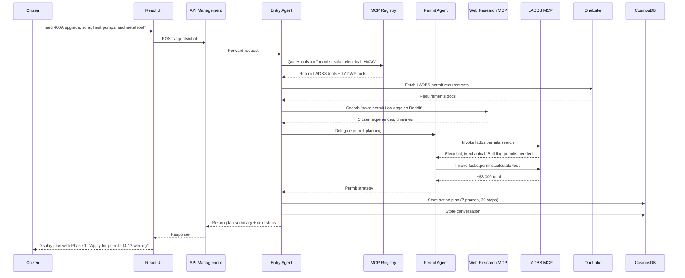
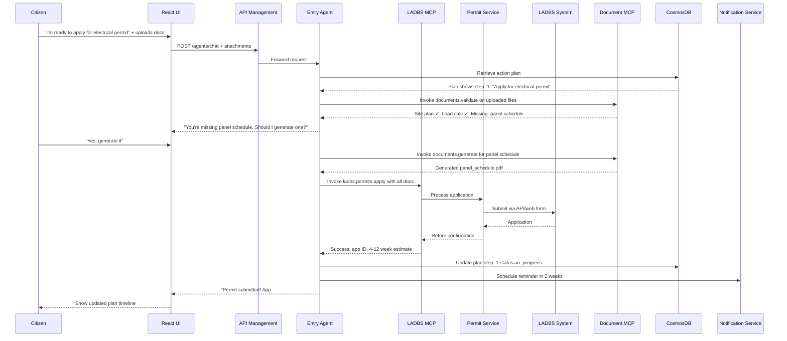
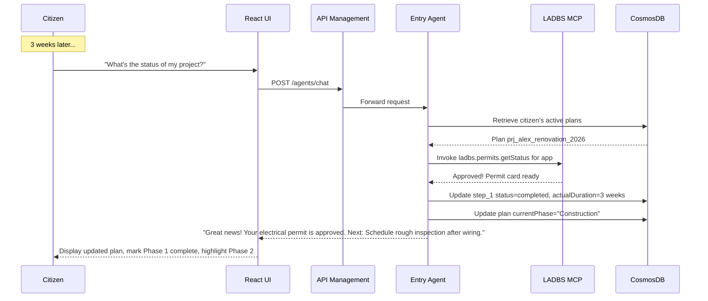
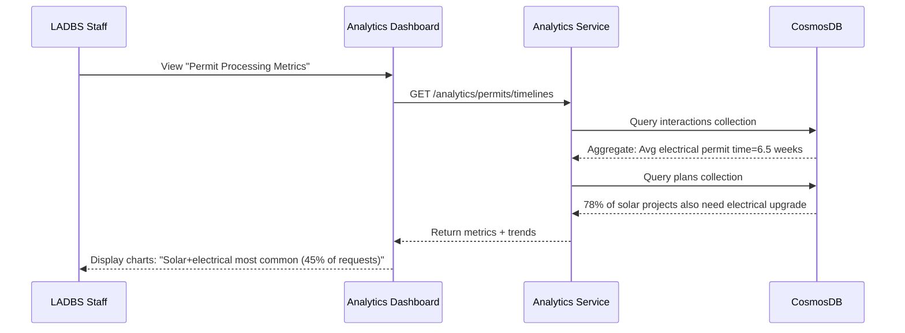

# Citizen Services Portal - Azure Architecture

## Executive Summary

This architecture defines an AI-powered citizen services platform hosted entirely on Microsoft Azure, designed to transform fragmented government services into a unified, intelligent digital experience. The solution addresses the challenges illustrated in the Los Angeles home renovation case study, where citizens navigate 20+ disconnected interactions across multiple agencies (LADBS, LADWP, LASAN) over months of manual processes.

At the heart of this platform is a **Model Context Protocol (MCP) server architecture** that wraps existing agency systems—whether modern APIs, legacy web forms, or manual mail-in processes—and exposes them as standardized tools to AI agents. Through an MCP server registry in Azure API Management, intelligent agents dynamically discover and orchestrate the right combination of tools to handle diverse citizen requests. The system builds comprehensive action plans, tracks progress across multi-week projects, and learns from both official documentation and citizen experiences shared online—reducing administrative overhead, improving transparency, and building citizen trust.

## Business Context

### The Challenge
- **Fragmented Services**: Citizens interact with multiple agencies through separate portals with inconsistent processes
- **Manual, Slow Processes**: Permit applications, utility upgrades, and inspections take 4-20+ weeks due to manual reviews
- **Limited Visibility**: No unified tracking across building permits, utility interconnections, inspections, violations, and rebates
- **Reactive Support**: Citizens discover requirements late, face unexpected delays, and lack proactive guidance
- **Administrative Burden**: Government agencies handle repetitive inquiries, duplicate data entry, and uncoordinated timelines

### Target Outcomes
- **Unified Digital Experience**: Single portal for all government services with AI-powered assistance
- **Faster Service Delivery**: Automated routing, pre-filled applications, real-time status updates
- **Proactive Guidance**: Virtual assistants anticipate needs (e.g., rebate eligibility) and prevent errors
- **Reduced Costs**: Lower administrative overhead through automation and self-service
- **Increased Trust**: Transparent processes, consistent communication, and responsive support

## Architecture Principles

1. **AI-First Design**: Intelligent agents at the core of citizen interactions with dynamic tool orchestration
2. **MCP-Based Integration**: Standardized tool protocol wrapping heterogeneous agency systems (APIs, forms, manual processes)
3. **Cloud-Native**: Fully hosted on Azure for scalability, resilience, and modern DevOps
4. **Registry-Driven Discovery**: Agents dynamically discover and select tools from centralized MCP registry
5. **Plan-Centric**: Build, track, and adapt multi-step action plans across extended citizen journeys
6. **Data-Driven**: Unified knowledge base combining official docs, regulations, and citizen insights from web
7. **Analytics-Enabled**: Capture patterns in requests, processes, timelines for continuous improvement
8. **Secure & Compliant**: Enterprise-grade security, identity management, and audit trails
9. **Observable**: Comprehensive monitoring, tracing, and evaluation of AI agent performance

## Core Architecture Components

### 1. MCP Server Layer: Government Service Integration

**Purpose**: Model Context Protocol (MCP) servers that wrap existing government agency systems and expose them as standardized, discoverable tools for AI agents.

**Architecture Pattern**:
Each government agency (LADBS, LADWP, LASAN) has dedicated MCP servers that abstract the complexity of their underlying systems:
- **Modern APIs**: Direct integration where REST/GraphQL endpoints exist
- **Web Forms**: Automated form submission via headless browsers or web scraping
- **Legacy Systems**: Screen scraping, RPA-style automation, or middleware connectors
- **Manual Processes**: Trigger human-in-the-loop workflows (email requests, PDF generation for mail-in forms)

**MCP Servers by Agency**:

**A. LADBS MCP Server** (Building & Safety)
- `ladbs.permits.search` - Search permit requirements by project type
- `ladbs.permits.apply` - Submit permit application with documents
- `ladbs.permits.getStatus` - Check application status and review comments
- `ladbs.permits.calculateFees` - Calculate permit fees based on scope/valuation
- `ladbs.inspections.schedule` - Book inspection appointments
- `ladbs.inspections.getResults` - Retrieve inspection outcomes
- `ladbs.violations.report` - Submit code violation report
- `ladbs.violations.respond` - Submit response to violation notice with evidence
- `ladbs.violations.getStatus` - Check violation case status

**B. LADWP MCP Server** (Water & Power)
- `ladwp.service.requestUpgrade` - Request electrical service upgrade (e.g., 200A to 400A)
- `ladwp.service.getRequirements` - Get utility upgrade requirements and timelines
- `ladwp.interconnection.apply` - Submit solar/battery interconnection agreement
- `ladwp.interconnection.getStatus` - Track IA review and approval
- `ladwp.rebates.checkEligibility` - Check eligibility for CRP and other rebate programs
- `ladwp.rebates.apply` - Submit rebate application with documentation
- `ladwp.rebates.trackStatus` - Track rebate processing and payment
- `ladwp.inspections.schedule` - Schedule utility inspections (e.g., final meter inspection)

**C. LASAN MCP Server** (Sanitation & Environment)
- `lasan.bulkyPickup.schedule` - Schedule bulky item collection (appliances, furniture)
- `lasan.eWaste.schedule` - Schedule e-waste curbside pickup
- `lasan.pickup.getStatus` - Check pickup confirmation and timing
- `lasan.disposal.getGuidelines` - Get disposal guidelines for specific materials
- `lasan.safeCenter.findLocations` - Find S.A.F.E. center locations and hours

**D. Web Research MCP Server**
- `web.search` - Search Reddit, forums, blogs for citizen experiences
- `web.fetch` - Retrieve content from specific URLs (e.g., Reddit threads)
- `web.summarize` - Extract key insights from community discussions

**E. Document Processing MCP Server**
- `documents.extract` - Extract text and data from PDFs, images (OCR)
- `documents.validate` - Validate document completeness (e.g., permit plans, invoices)
- `documents.generate` - Generate filled forms, applications, supporting docs

**Deployment**:
- Each MCP server runs as a containerized service in **Azure Container Apps**
- Auto-scales based on tool invocation volume
- Implements MCP protocol over HTTP transport
- Exposes OpenAPI-style tool schemas for discovery

**Implementation Strategies**:
- **API-Available**: Direct HTTP calls to agency APIs (mock or real)
- **Web-Form-Only**: Playwright/Selenium automation against agency websites
- **No-Digital-Option**: Generate email requests or print-ready PDFs, trigger notifications to staff for manual submission
- **Hybrid**: Combine approaches (e.g., web scraping for search, API for submission)

### 2. MCP Registry & Gateway: Azure API Management

**Purpose**: Centralized MCP server registry, tool discovery, and governed access to all tools via Azure API Management.

**Key Functions**:

**A. MCP Server Registry**
- **Tool Catalog**: Maintains registry of all available MCP tools with schemas, descriptions, agency mappings
- **Dynamic Discovery**: Agents query registry to find tools by capability (e.g., "permit submission", "rebate eligibility")
- **Versioning**: Support multiple versions of tools as agency systems evolve
- **Metadata**: Tags (agency, category, automation level), usage stats, reliability scores

**B. API Gateway Functions**
- **Unified Endpoint**: Single entry point for agents to invoke any MCP tool: `/mcp/{server}/{tool}`
- **Authentication & Authorization**: Azure AD service principals, API keys per MCP server
- **Rate Limiting & Quotas**: Protect backend systems from overload, ensure fair usage across agents
- **Policy Enforcement**: Validation, transformation, caching, circuit breakers for flaky systems
- **Multi-Server Routing**: Route tool calls to appropriate MCP server instances with load balancing
- **Analytics & Logging**: Capture tool usage patterns, latency, success/failure rates

**C. Model Access** (retained from original)
- Expose AI model endpoints from Microsoft Foundry
- Apply same governance policies (auth, rate limiting, monitoring)

**Registry Schema Example**:
```json
{
  "tools": [
    {
      "id": "ladbs.permits.apply",
      "server": "ladbs-mcp",
      "name": "Apply for Building Permit",
      "description": "Submit a building permit application to LADBS with project details and documents",
      "agency": "LADBS",
      "category": "permits",
      "automationLevel": "partial",
      "inputSchema": { /* JSON Schema */ },
      "outputSchema": { /* JSON Schema */ },
      "version": "1.0",
      "reliability": 0.95,
      "avgLatency": "2.5s"
    }
  ]
}
```

### 3. Knowledge Foundation: Microsoft Fabric OneLake

**Purpose**: Centralized data lakehouse storing all government service documentation, regulations, forms, and historical interactions.

**Key Responsibilities**:
- Store structured and unstructured government documents (building codes, permit requirements, utility guidelines, rebate programs)
- Maintain versioned regulatory content (e.g., LAMC codes, Title 24 energy standards)
- Provide data for AI model training and agent knowledge bases
- Enable analytics on citizen interactions and service performance
- Support data governance and lineage tracking

**Content Types**:
- Building permit requirements and forms (LADBS)
- Utility service procedures and interconnection agreements (LADWP)
- Waste disposal guidelines and scheduling rules (LASAN)
- Zoning regulations, fee schedules, inspection checklists
- Historical case data for pattern recognition and recommendations

### 4. AI Platform: Microsoft Foundry (Azure AI Foundry)

**Purpose**: Central AI platform for deploying models, building hosted agents with MCP tool orchestration, and managing AI operations.

**Key Capabilities**:

**A. Model Deployment**
- Deploy and host foundation models (GPT-4, GPT-4o, etc.) for natural language understanding, planning, and reasoning
- Support specialized models for document processing, classification, and entity extraction
- Enable prompt flow orchestration for complex agent workflows

**B. Hosted Agents on Microsoft Agent Framework**
- Deploy intelligent agents as managed services with built-in scalability
- Implement dynamic MCP tool discovery and invocation
- Leverage agent-specific services (session management, context handling, tool orchestration)
- Support multi-turn conversations with plan persistence

**C. Agent Architecture**

**Entry Agent (Orchestrator)**
- Primary citizen-facing agent that handles all initial requests
- Queries MCP registry to discover relevant tools for citizen's request
- Builds comprehensive action plans by:
  - Analyzing official documentation from OneLake
  - Searching web for citizen experiences (Reddit, forums)
  - Decomposing complex requests into sequential/parallel steps
- Routes to specialized agents or directly invokes MCP tools
- Maintains conversation context and plan state in CosmosDB
- Adapts plans based on citizen feedback and evolving requirements

**Specialized Domain Agents** (invoked by Entry Agent)
- **Permit Planning Agent**: Deep expertise in LADBS permit requirements, generates detailed permit strategies
- **Utility Planning Agent**: Specializes in LADWP service upgrades, interconnections, timelines
- **Compliance Agent**: Validates project compliance with codes (LAMC, Title 24), identifies potential violations
- **Financial Agent**: Calculates total costs (permits, upgrades, fees), identifies rebate opportunities
- **Timeline Agent**: Estimates realistic timelines based on historical data, current backlogs

**Plan Structure Example**:
```json
{
  "planId": "prj_alex_renovation_2026",
  "citizen": "alex@example.com",
  "projectDescription": "400A upgrade, rewiring, ductless heat pumps, solar+batteries, metal roof",
  "phases": [
    {
      "phase": "Permit Applications",
      "steps": [
        {
          "stepId": "step_1",
          "description": "Apply for electrical permit (400A upgrade, rewiring, solar, batteries)",
          "status": "completed",
          "assignedAgent": "Permit Planning Agent",
          "mcpTools": ["ladbs.permits.search", "ladbs.permits.apply"],
          "documents": ["site_plan.pdf", "load_calc.xlsx"],
          "estimatedDuration": "4-12 weeks",
          "actualDuration": "8 weeks",
          "notes": "Submitted 2025-12-01, approved 2026-01-26 after one revision round"
        }
      ]
    }
  ],
  "currentPhase": "Construction",
  "nextActions": ["Schedule rough electrical inspection"]
}
```

**D. AI Operations**
- **Evaluations**: Assess agent response quality, accuracy, plan effectiveness, and compliance with policies
- **Tracing**: Monitor agent execution paths, MCP tool calls, plan modifications, and decision points
- **Monitoring**: Track performance metrics, latency, error rates, user satisfaction, and plan success rates

### 3. API Gateway: Azure API Management

**Purpose**: Centralized API gateway providing unified access to AI models and backend services with governance, security, and scalability.

**Key Functions**:
- **Unified Endpoint**: Single entry point for all model and agent interactions
- **Authentication & Authorization**: Azure AD integration, API key management, OAuth 2.0
- **Rate Limiting & Throttling**: Protect backend services from overload, ensure fair usage
- **Policy Enforcement**: Apply transformation, validation, caching, and retry policies
- **Multi-Model Routing**: Load balance across multiple model deployments and endpoints
- **Analytics & Logging**: Capture API usage, performance metrics, and audit trails
- **Version Management**: Support multiple API versions for backward compatibility

**Exposed APIs**:
- `/agents/chat`: Conversational interface to AI agents
- `/permits/submit`: Permit application submission and validation
- `/inspections/schedule`: Inspection booking and management
- `/rebates/check`: Eligibility verification and application support
- `/violations/report`: Code violation reporting and tracking
- `/documents/search`: Knowledge base search and retrieval

### 5. Agent Memory & Plan Tracking: Azure CosmosDB

**Purpose**: Persistent, globally distributed storage for agent conversation history, action plans, user context, and comprehensive analytics data.

**Key Use Cases**:
- **Conversation Memory**: Store chat history for continuity across sessions (citizens return over weeks/months)
- **Action Plan Storage**: Persist multi-phase plans with step status, timelines, documents, and outcomes
- **User Profiles**: Maintain citizen preferences, properties, ongoing projects, and service history
- **Application State**: Track multi-step processes (permits, rebates, inspections) across interactions
- **Agent Context**: Store entity extractions, decisions, tool invocations, and intermediate results
- **Analytics Data**: Capture request patterns, process involvement, time-to-completion for reporting
- **Audit Trail**: Maintain immutable records of agent actions, recommendations, and MCP tool calls

**Data Models**:

**A. Sessions Collection**
- User sessions with conversation threads
- Linked to active action plans
- Timestamps for session start, last activity, total duration

**B. Citizens Collection**
- Profiles with contact info, addresses, properties
- Service history across all agencies
- Preferences (notification channels, language)

**C. Action Plans Collection** (Critical for Extended Journeys)
- Comprehensive multi-phase plans (structure shown above in Foundry section)
- Phase/step hierarchy with dependencies
- Status tracking: not_started, in_progress, blocked, completed, cancelled
- Estimated vs. actual timelines for each step
- Documents associated with each step
- Notes and insights from web research
- Plan revisions and adaptation history

**D. Interactions Collection** (Analytics Focus)
- Every citizen request with intent classification
- Agencies involved (LADBS, LADWP, LASAN, etc.)
- MCP tools invoked per request
- Success/failure outcomes
- Timestamps for duration analysis
- Structured for aggregation queries:
  - "Most common request types"
  - "Average time from permit application to approval"
  - "Which processes involve most agencies"
  - "Bottleneck identification"

**E. MCP Tool Invocations Collection**
- Detailed log of every tool call
- Input parameters, output results, latency
- Success/failure, error messages
- Agent context at time of invocation
- Used for reliability scoring and debugging

**Features Leveraged**:
- Low-latency global distribution for fast access
- Automatic indexing for efficient queries (e.g., "all active plans for citizen X")
- Change feed for real-time event processing (e.g., trigger notifications on plan updates)
- Multi-region replication for high availability
- Time-to-live (TTL) for automatic data retention policies (e.g., archive old interactions)

### 6. Application Services: Azure Container Apps

**Purpose**: Host scalable, microservices-based application backend including MCP servers, business logic, integrations, and analytics.

**Deployed Services**:

**A. MCP Servers** (Primary Integration Layer)
- **LADBS MCP Server**: Container exposing building/safety tools
- **LADWP MCP Server**: Container exposing water/power tools
- **LASAN MCP Server**: Container exposing sanitation tools
- **Web Research MCP Server**: Container for web scraping and search
- **Document Processing MCP Server**: Container for PDF/OCR operations
- Each implements MCP protocol over HTTP
- Auto-scales based on tool invocation rate
- Includes retry logic, circuit breakers for external dependencies

**B. Permit Service** (Supports LADBS MCP Server)
- Process permit applications and validations
- Integrate with LADBS systems (mock or real APIs, web forms)
- Generate application PDFs and required documents
- Calculate fees based on project scope and valuation

**C. Utility Service** (Supports LADWP MCP Server)
- Coordinate LADWP service upgrades and interconnection agreements
- Track utility timelines and requirements
- Generate single-line diagrams and technical specifications
- Handle IA application submission and status polling

**D. Inspection Service**
- Schedule inspections across LADBS and LADWP (via MCP tools)
- Send notifications and reminders (SMS, email)
- Capture inspection results and manage re-inspections
- Coordinate multi-agency inspection sequences

**E. Rebate Service** (Supports LADWP MCP Server)
- Check eligibility against LADWP CRP and other programs
- Pre-fill rebate applications from permit data
- Track application status and payment
- Proactively notify citizens of eligible programs

**F. Integration Service**
- Connect to legacy government systems (simulated or real)
- Handle authentication and data transformation
- Provide webhook endpoints for external notifications
- Trigger human-in-the-loop processes (email generation for manual submissions)

**G. Notification Service**
- Multi-channel notifications (email, SMS, push, in-app)
- Template management for government communications
- Delivery tracking and retry logic
- Plan status updates ("Your permit was approved!")

**H. Analytics Service** (New)
- Query CosmosDB interactions collection for reports
- Generate dashboards on:
  - Request volume by type, agency, time period
  - Average time-to-completion for processes
  - Most common multi-agency workflows
  - Bottleneck identification (steps with longest delays)
  - Citizen satisfaction scores from feedback
- Export data to Power BI for government stakeholders
- Provide insights for process improvement

**Features**:
- Auto-scaling based on demand (e.g., surge during permit season)
- Managed certificates and custom domains
- Integrated with Azure AD for service-to-service authentication
- Dapr integration for service discovery, pub/sub, and state management
- Blue/green deployments for zero-downtime updates

### 7. Web Front-End: React-Based UI

**Purpose**: Responsive, accessible web interface for citizens to interact with AI agents and government services.

**Technology Selection Criteria**:
- **React** (or Next.js): Strong ecosystem, server-side rendering, component libraries
- **Blazor**: Consideration for .NET integration if backend is C#
- **Vue.js/Nuxt**: Lightweight alternative with good chat component support

**Key Requirements**:
- Pre-built chat components for agent conversations
- Accessibility compliance (WCAG 2.1 AA for government services)
- Mobile-responsive design for on-the-go access
- Real-time updates for application status
- Document upload and preview capabilities
- Integration with Azure AD B2C for citizen authentication

**UI Flows**:
- **Home**: Overview of services, quick actions, application status dashboard
- **Chat Interface**: Conversational AI agent with suggested prompts and rich responses
- **Application Forms**: Pre-filled, step-by-step permit/rebate applications
- **Status Tracking**: Real-time timelines showing progress across agencies
- **Document Library**: Access to submitted forms, approvals, and receipts
- **Notifications**: Centralized inbox for updates, reminders, and alerts

**Component Libraries Evaluated**:
- **Material-UI (MUI)**: Comprehensive, accessible, customizable
- **Ant Design**: Enterprise-focused with government-friendly styling
- **Chakra UI**: Modern, accessible, with good chat examples
- **Custom Components**: Built specifically for government workflows

## Architecture Diagram

### High-Level System Architecture

```mermaid
graph TB
    subgraph "Citizen Layer"
        Citizen["👤 Citizens<br/>(Web/Mobile)"]
    end

    subgraph "Presentation Layer"
        UI["React Front-End<br/>Chat • Plans • Status • Forms"]
    end

    subgraph "API Gateway Layer - Azure API Management"
        APIM["API Management<br/>Auth • Rate Limit • Routing"]
        Registry["MCP Registry<br/>Tool Catalog & Discovery"]
    end

    subgraph "AI Agent Layer - Microsoft Foundry"
        EntryAgent["Entry Agent<br/>(Orchestrator)"]
        PermitAgent["Permit Planning Agent"]
        UtilityAgent["Utility Planning Agent"]
        ComplianceAgent["Compliance Agent"]
        FinancialAgent["Financial Agent"]
        TimelineAgent["Timeline Agent"]
        Models["AI Models<br/>GPT-4o • Document AI"]
        Tracing["Tracing & Evaluations"]
    end

    subgraph "MCP Server Layer - Azure Container Apps"
        LADBS_MCP["LADBS MCP Server<br/>Permits • Inspections • Violations"]
        LADWP_MCP["LADWP MCP Server<br/>Service Upgrades • Solar • Rebates"]
        LASAN_MCP["LASAN MCP Server<br/>Waste Pickup • Disposal"]
        Web_MCP["Web Research MCP<br/>Reddit • Forums • Community"]
        Doc_MCP["Document MCP<br/>OCR • Validation • Generation"]
    end

    subgraph "Application Services Layer - Azure Container Apps"
        PermitSvc["Permit Service"]
        UtilitySvc["Utility Service"]
        InspectionSvc["Inspection Service"]
        RebateSvc["Rebate Service"]
        IntegrationSvc["Integration Service<br/>(Human-in-Loop)"]
        NotificationSvc["Notification Service"]
        AnalyticsSvc["Analytics Service<br/>Reports • Dashboards"]
    end

    subgraph "Data & State Layer"
        Cosmos[("Azure CosmosDB<br/>Plans • Sessions<br/>Citizens • Analytics")]
        OneLake[("Microsoft Fabric OneLake<br/>Gov't Docs • Regulations<br/>Historical Data")]
    end

    subgraph "External Systems"
        LADBS_Sys["LADBS Systems<br/>APIs • Web Forms • Manual"]
        LADWP_Sys["LADWP Systems<br/>APIs • Web Forms • Manual"]
        LASAN_Sys["LASAN Systems<br/>Phone/Web Scheduling"]
        Web["Internet<br/>Reddit • Forums • Docs"]
    end

    %% Connections
    Citizen --> UI
    UI --> APIM
    APIM --> EntryAgent
    APIM --> Registry
    
    EntryAgent -."discover tools".-> Registry
    EntryAgent --> Models
    EntryAgent --> PermitAgent
    EntryAgent --> UtilityAgent
    EntryAgent --> ComplianceAgent
    EntryAgent --> FinancialAgent
    EntryAgent --> TimelineAgent
    
    EntryAgent --> Tracing
    PermitAgent --> Tracing
    UtilityAgent --> Tracing
    
    EntryAgent -."invoke tools via APIM".-> APIM
    APIM --> LADBS_MCP
    APIM --> LADWP_MCP
    APIM --> LASAN_MCP
    APIM --> Web_MCP
    APIM --> Doc_MCP
    
    LADBS_MCP --> PermitSvc
    LADWP_MCP --> UtilitySvc
    LADWP_MCP --> RebateSvc
    LADBS_MCP --> InspectionSvc
    LADWP_MCP --> InspectionSvc
    LASAN_MCP --> IntegrationSvc
    
    PermitSvc --> LADBS_Sys
    UtilitySvc --> LADWP_Sys
    RebateSvc --> LADWP_Sys
    IntegrationSvc --> LASAN_Sys
    Web_MCP --> Web
    
    NotificationSvc -."email/SMS".-> Citizen
    
    EntryAgent <--> Cosmos
    PermitAgent <--> Cosmos
    UtilityAgent <--> Cosmos
    AnalyticsSvc --> Cosmos
    
    EntryAgent --> OneLake
    PermitAgent --> OneLake
    UtilityAgent --> OneLake
    
    classDef agentStyle fill:#4CAF50,stroke:#2E7D32,color:#fff
    classDef mcpStyle fill:#2196F3,stroke:#1565C0,color:#fff
    classDef dataStyle fill:#FF9800,stroke:#E65100,color:#fff
    classDef externalStyle fill:#9E9E9E,stroke:#616161,color:#fff
    
    class EntryAgent,PermitAgent,UtilityAgent,ComplianceAgent,FinancialAgent,TimelineAgent agentStyle
    class LADBS_MCP,LADWP_MCP,LASAN_MCP,Web_MCP,Doc_MCP mcpStyle
    class Cosmos,OneLake dataStyle
    class LADBS_Sys,LADWP_Sys,LASAN_Sys,Web externalStyle
```



## Data Flow Examples

### Example 1: Initial Request - Building Action Plan



**Outcome**: Citizen has comprehensive multi-phase plan stored in CosmosDB, can proceed with Phase 1 or ask questions.

### Example 2: Submitting Permit Application



**Outcome**: Step tracked in plan, citizen returns later to check status or continue with next steps.

### Example 3: Returning Citizen - Plan Continuation



**Outcome**: Seamless continuity over weeks/months; citizen doesn't repeat context.

### Example 4: Analytics - Government Insights



**Outcome**: Government identifies bundling opportunities, staffing needs, process bottlenecks.

## Security & Compliance

- **Authentication**: Azure AD B2C for citizen identity, Azure AD for internal services
- **Authorization**: Role-based access control (RBAC) for government staff vs. citizens
- **Data Encryption**: In-transit (TLS 1.3) and at-rest (Azure Storage encryption)
- **Compliance**: HIPAA, FedRAMP, GDPR considerations for government data
- **Audit Logging**: Comprehensive logging in Azure Monitor and Application Insights
- **Secrets Management**: Azure Key Vault for API keys, connection strings, certificates

## Observability & Operations

- **Application Insights**: Track front-end and Container Apps performance
- **Foundry Tracing**: Monitor agent execution paths and tool calls
- **Foundry Evaluations**: Assess agent quality, accuracy, and policy compliance
- **API Management Analytics**: API usage patterns, latency, error rates
- **Azure Monitor**: Infrastructure health, resource utilization, alerting
- **Log Analytics**: Centralized logging with KQL queries for troubleshooting

## Scalability & Resilience

- **Auto-Scaling**: Container Apps and API Management scale based on demand
- **Global Distribution**: CosmosDB multi-region replication for low latency
- **Caching**: API Management response caching for frequently accessed data
- **Circuit Breakers**: Dapr resiliency patterns in Container Apps
- **Graceful Degradation**: Fallback responses if AI agents unavailable
- **Disaster Recovery**: Geo-redundant backups, automated failover strategies

## Next Steps

### Phase 1: Foundation & Planning (Weeks 1-2)
1. **MCP Server Design**: Define detailed tool schemas for each agency (input/output, error handling)
2. **Registry Schema**: Design MCP registry structure in APIM with versioning and metadata
3. **Data Modeling**: 
   - CosmosDB collections (sessions, citizens, plans, interactions, tool_invocations)
   - OneLake structure (documents by agency, regulations, historical data)
4. **Action Plan Schema**: Formalize plan structure (phases, steps, status, documents, timelines)

### Phase 2: Core Infrastructure (Weeks 3-4)
5. **Azure Infrastructure Setup**: Deploy APIM, Container Apps, CosmosDB, OneLake using Bicep/Terraform
6. **Mock Agency Systems**: Build mock LADBS/LADWP/LASAN endpoints (REST APIs returning realistic data)
7. **MCP Server Implementation**: Build 2 initial MCP servers (LADBS, LADWP) with 3-5 tools each
8. **Registry Implementation**: Configure APIM with MCP tool catalog and discovery endpoint

### Phase 3: Agent Development (Weeks 5-6)
9. **Entry Agent Development**: Implement orchestrator with tool discovery, plan generation, multi-turn conversation
10. **Specialized Agent**: Build Permit Planning Agent as first domain expert
11. **Prompt Engineering**: Design system prompts for plan creation, tool selection, citizen communication
12. **CosmosDB Integration**: Implement plan persistence and retrieval

### Phase 4: End-to-End MVP (Weeks 7-8)
13. **UI Development**: Build React chat interface with plan visualization and status tracking
14. **Integration Testing**: Test complete flow: request → plan → tool invocation → status update
15. **Web Research Integration**: Add Reddit/forum search capability to enrich plans with citizen insights
16. **Analytics Service**: Implement basic reporting (request types, tool usage, timelines)

### Phase 5: Evaluation & Refinement (Weeks 9-10)
17. **Tracing Setup**: Configure Foundry tracing for all agent and tool interactions
18. **Evaluation Framework**: Define metrics (plan quality, tool success rate, citizen satisfaction)
19. **Test Scenarios**: Run 20+ realistic citizen scenarios from story-line document
20. **Iteration**: Refine agent prompts, tool implementations, plan structures based on results

### Phase 6: Expansion & Pilot (Weeks 11-12)
21. **Additional MCP Servers**: Implement LASAN, Web Research, Document Processing servers
22. **More Tools**: Expand to 20+ tools covering full renovation journey
23. **Human-in-Loop**: Implement email/manual submission flows for non-digital processes
24. **Pilot Preparation**: Documentation, training materials, controlled user testing
25. **Deployment Pipeline**: CI/CD for agents, MCP servers, and infrastructure

### Success Metrics
- **Technical**: 95% tool success rate, <3s response time, <5% agent errors
- **User**: 80% citizen satisfaction, 50% reduction in support inquiries
- **Business**: 30% faster permit process, 3x increase in rebate applications
- **Analytics**: Comprehensive reporting on process bottlenecks and improvement opportunities

---

*This architecture provides the foundation for transforming fragmented government services into an AI-powered, citizen-centric platform that delivers faster, more transparent, and more accessible public services on Microsoft Azure.*
