# Refactoring: MCP Reporting → MCP CSP

## Overview

This document outlines the refactoring of the existing **MCP Reporting** server into a more comprehensive **MCP CSP (Citizen Services Portal)** server. The new MCP CSP becomes the central service for managing portal operations, specifically:

1. **Plan Lifecycle Management** — Create, update, and modify project plans directly via MCP tools
2. **Step Timing Analytics** — Track step completion durations for reporting (existing reporting functionality)

---

## Problem Statement

### Current Architecture Pain Points

1. **Indirect Plan Updates**: Currently, the agent outputs special `json:plan` blocks in chat responses, which the UI intercepts to update the plan. This creates tight coupling between agent output format and UI parsing logic.

2. **No Direct Plan Control**: The agent cannot programmatically create or update plans — it must rely on structured output that the UI interprets.

3. **Scattered Responsibilities**: Plan storage is in CosmosDB `projects` container, but there's no MCP service that owns plan operations.

4. **Reporting is Disconnected**: The Reporting MCP server tracks step completions independently, but has no visibility into actual plan step transitions.

### Target State

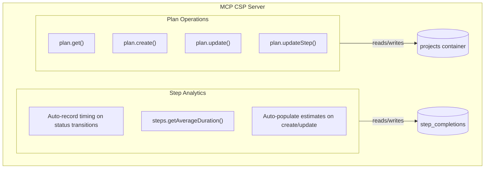

---

## Core Concepts

### 1. Agent Updates Plans via MCP (Not Chat Output)

**Before:**
```
Agent → outputs ```json:plan {...} ``` → UI parses → UI writes to CosmosDB
```

**After:**
```
Agent → calls MCP CSP plan.updateStep() → MCP CSP writes to CosmosDB
Agent → outputs <<PLAN_UPDATED>> signal → UI reloads project component
```

The agent uses a lightweight chat signal (e.g., `<<PLAN_UPDATED>>`) to notify the UI to refresh, rather than embedding the entire plan in the response.

### 2. Step Timing is Automatic

When `plan.updateStep()` transitions a step status, the MCP CSP service automatically:
- Records `started_at` timestamp (on transition to `SCHEDULED` or `IN_PROGRESS`)
- Records `completed_at` timestamp (on terminal status: `COMPLETED`, `NEEDS_REWORK`, `REJECTED`)
- Writes to `step_completions` container for historical analytics

### 3. Estimated Durations are Auto-Populated

When the agent calls `plan.create()` or `plan.update()` with new steps:
- Agent provides: step type, title, description, agency, dependencies
- Agent does NOT set: `estimated_duration_days`
- MCP CSP service layer automatically queries historical data and populates `estimated_duration_days` for new steps before returning

### 4. Rework Creates New Steps (Supersedes Pattern)

When a step fails (e.g., inspection fails), the original step becomes terminal with `NEEDS_REWORK` status. The agent creates new steps that link back via `supersedes` field, forming a chain for accurate end-to-end time tracking.

---

## Step Design

### Design Principles

1. **One Step = One Logical Action** — An inspection is one step, not multiple sub-steps
2. **Expanded Statuses** — Different step types use different valid status progressions
3. **Terminal Failure States** — `NEEDS_REWORK` and `REJECTED` are terminal; agent creates new steps to continue
4. **Chain-Based Time Tracking** — For analytics, measure from first step's `started_at` to final step's `completed_at` in the supersedes chain

### Step Statuses

| Status | Description | Terminal? |
|--------|-------------|-----------|
| `DEFINED` | Step created, not yet started | No |
| `SCHEDULED` | Appointment/date set (inspections, pickups) | No |
| `IN_PROGRESS` | Actively being processed (permits, applications) | No |
| `COMPLETED` | Successfully finished | Yes ✓ |
| `NEEDS_REWORK` | Failed/issues, new step will be created | Yes ✗ |
| `REJECTED` | Denied, may abandon or refile | Yes ✗ |

### Step Status Lifecycle

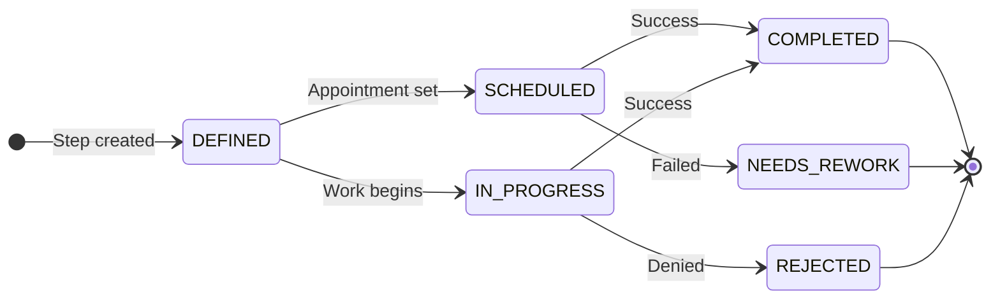

**Note on terminal states:**
- `NEEDS_REWORK`: Agent creates new step with `supersedes` link
- `REJECTED`: User decides to refile or abandon

### Status Progressions by Step Type

| Step Type | Valid Progression |
|-----------|-------------------|
| `permits.submit` | DEFINED → IN_PROGRESS → COMPLETED / REJECTED |
| `inspection.schedule` | DEFINED → SCHEDULED → COMPLETED / NEEDS_REWORK |
| `rebates.apply` | DEFINED → IN_PROGRESS → COMPLETED / REJECTED |
| `interconnection.submit` | DEFINED → IN_PROGRESS → COMPLETED / REJECTED |
| `pickup.schedule` | DEFINED → SCHEDULED → COMPLETED |
| `user.action` | DEFINED → IN_PROGRESS → COMPLETED |

### Step Types

Step types represent the logical action being performed. They are used for analytics aggregation.

```python
class StepType(str, Enum):
    """Normalized step types for analytics aggregation."""
    PERMIT_SUBMIT = "permits.submit"
    INSPECTION_SCHEDULE = "inspection.schedule"
    TOU_ENROLL = "tou.enroll"
    INTERCONNECTION_SUBMIT = "interconnection.submit"
    REBATE_APPLY = "rebates.apply"
    PICKUP_SCHEDULE = "pickup.schedule"
    USER_ACTION = "user.action"
```

> Note: Status-check operations (like `permits.getStatus`) are MCP tool calls, not step types. A step type represents a unit of work, not a query.

### Step Automation

Steps are classified as **automated** or **non-automated** based on whether the MCP server can handle them entirely.

| Automation | Description | Visual | Example |
|------------|-------------|--------|----------|
| `automated=true` | MCP server handles the step end-to-end | Agent-driven indicator | Submit permit, check status, file interconnection |
| `automated=false` | Requires user action outside the system | User-driven indicator | Install solar panels, fix wiring issues, schedule with contractor |

**Key Principle**: If the system can perform an action (e.g., file a permit), it should also handle related operations (e.g., check permit status). Automation is all-or-nothing for a given step type.

#### Action Cards for Non-Automated Steps

When a non-automated step transitions to `IN_PROGRESS`, the system:

1. **Generates an Action Card** — A structured prompt describing what the user needs to do
2. **Stores it in the step** — The `action_card` field holds the card data
3. **Sends to user via chat** — Agent includes the action card in its response

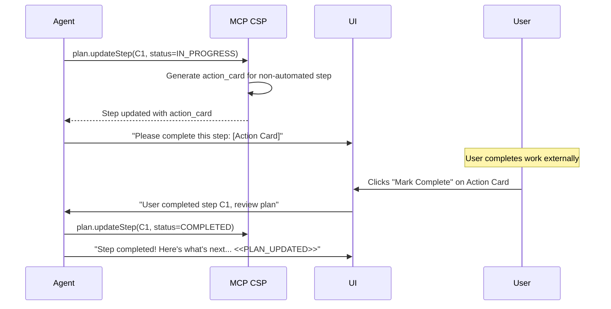

#### Action Card Schema

```python
class ActionCard(BaseModel):
    """Structured prompt for user-driven steps."""
    title: str                              # e.g., "Install Solar Panels"
    description: str                        # What needs to be done
    instructions: Optional[List[str]] = []  # Step-by-step guidance
    completion_prompt: str                  # e.g., "Click when installation is complete"
    created_at: datetime
```

#### UI Responsibilities

- **Display**: Render action cards with clear visual distinction (user-driven styling)
- **Completion**: Provide "Mark Complete" button that triggers agent to update step
- **Review**: After user marks complete, UI prompts agent: *"User completed step {id}, please review the plan and advise on next steps"*

---

## Rework Handling (Supersedes Pattern)

When a step results in `NEEDS_REWORK` or `REJECTED`, the original step remains in that terminal state. The agent creates new steps that reference the original via `supersedes`, forming a chain.

### Rework Flow

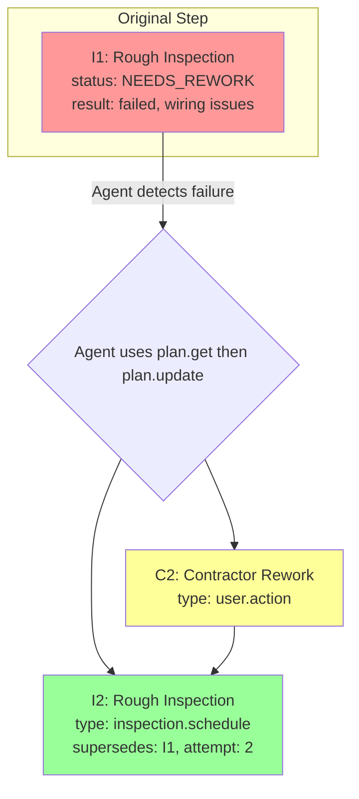

### Chain-Based Time Tracking

For analytics, when a step is part of a rework chain, we track the end-to-end duration:

```mermaid
gantt
    title Inspection Chain - Time Tracking
    dateFormat  YYYY-MM-DD
    
    section Attempt 1
    I1: Rough Inspection       :crit, i1, 2026-01-21, 2026-01-25
    
    section Rework
    C2: Contractor Rework      :active, c2, 2026-01-26, 2026-02-01
    
    section Attempt 2
    I2: Rough Inspection       :done, i2, 2026-02-02, 2026-02-10
    
    section Analytics
    Chain Duration: 20 days    :milestone, 2026-02-10, 0d
```

When logging to `step_completions` for a step that completes a chain:

```python
{
    "step_type": "inspection.schedule",
    "chain_started_at": "2026-01-21",   # I1's started_at (first in chain)
    "completed_at": "2026-02-10",        # I2's completed_at (final)
    "attempts": 2,
    "duration_days": 20                  # End-to-end
}
```

---

## Step Schema

### PlanStep Model

```python
from pydantic import BaseModel
from datetime import datetime
from typing import Optional, List, Dict, Any
from enum import Enum

class StepStatus(str, Enum):
    DEFINED = "defined"
    SCHEDULED = "scheduled"
    IN_PROGRESS = "in_progress"
    COMPLETED = "completed"
    NEEDS_REWORK = "needs_rework"
    REJECTED = "rejected"

class StepType(str, Enum):
    """Normalized step types for analytics aggregation."""
    PERMIT_SUBMIT = "permits.submit"
    INSPECTION_SCHEDULE = "inspection.schedule"
    TOU_ENROLL = "tou.enroll"
    INTERCONNECTION_SUBMIT = "interconnection.submit"
    REBATE_APPLY = "rebates.apply"
    PICKUP_SCHEDULE = "pickup.schedule"
    USER_ACTION = "user.action"

class PlanStep(BaseModel):
    """A single step in the project plan."""
    
    # Identity
    id: str                                    # Short ID (e.g., "P1", "I1", "I1.2")
    step_type: StepType                        # Normalized type for analytics
    
    # Display
    title: str                                 # Human-readable step name
    description: Optional[str] = None          # Detailed description
    agency: str                                # Agency code (LADBS, LADWP, LASAN)
    
    # Automation
    automated: bool = True                     # True = agent-driven, False = user-driven
    action_card: Optional[ActionCard] = None   # Generated on IN_PROGRESS for non-automated
    
    # Dependencies
    depends_on: List[str] = []                 # IDs of prerequisite steps
    
    # Lineage (for rework chains)
    supersedes: Optional[str] = None           # ID of step this replaces
    attempt_number: int = 1                    # 1, 2, 3... for retries
    
    # Status & Timing (managed by MCP CSP service)
    status: StepStatus = StepStatus.DEFINED
    started_at: Optional[datetime] = None      # Set on SCHEDULED or IN_PROGRESS
    completed_at: Optional[datetime] = None    # Set on terminal status
    
    # Estimated Duration (populated by MCP CSP service layer)
    estimated_duration_days: Optional[float] = None
    
    # Results (set on completion)
    result: Optional[Dict[str, Any]] = None    # Outcome data (permit #, failure reason, etc.)
    notes: Optional[str] = None                # Additional notes
```

### Key Schema Rules

| Field | Who Sets It | When |
|-------|-------------|------|
| `id`, `step_type`, `title`, `agency` | Agent | On plan creation or update |
| `automated` | Agent | On plan creation (based on step type capability) |
| `status` | Agent (via MCP) | Via `plan.updateStep()` |
| `action_card` | MCP CSP Service | Automatically on IN_PROGRESS for non-automated steps |
| `supersedes`, `attempt_number` | Agent | When creating rework steps via `plan.update()` |
| `started_at` | MCP CSP Service | Automatically on SCHEDULED/IN_PROGRESS |
| `completed_at` | MCP CSP Service | Automatically on terminal status |
| `estimated_duration_days` | MCP CSP Service | Automatically on `plan.create()` / `plan.update()` for new steps |
| `result`, `notes` | Agent | Via `plan.updateStep()` |

---

## MCP CSP Tool Specifications

### Tool: `plan.get`

Retrieves the full plan for a project.

```python
@mcp.tool(title="Get Project Plan")
async def plan_get(
    project_id: str,
) -> PlanGetResponse:
    """
    Get the full plan for a project.
    
    Use this to retrieve the current plan state before making updates.
    
    Args:
        project_id: The project UUID
    
    Returns:
        Complete plan with all steps and their current status
    """
```

**Service Layer Behavior:**
1. Fetch project from `projects` container
2. Return plan with all steps

---

### Tool: `plan.create`

Creates a new plan for a project.

```python
@mcp.tool(title="Create Project Plan")
async def plan_create(
    project_id: str,
    title: str,
    steps: List[PlanStepInput],
) -> PlanCreateResponse:
    """
    Create a new plan for a project.
    
    The service layer automatically populates estimated_duration_days
    for each step based on historical completion data.
    
    Args:
        project_id: The project UUID
        title: Plan title (e.g., "Solar Installation Plan")
        steps: List of steps (id, step_type, title, agency, depends_on)
    
    Returns:
        Created plan with estimates populated
    """
```

**Input Model:**
```python
class PlanStepInput(BaseModel):
    """Step input from agent."""
    id: str
    step_type: StepType
    title: str
    description: Optional[str] = None
    agency: str
    depends_on: List[str] = []
    
    # For rework scenarios
    supersedes: Optional[str] = None     # ID of step this replaces
    attempt_number: int = 1              # Attempt number (2, 3, etc. for retries)
```

**Service Layer Behavior:**
1. Validate project exists
2. For each step, query `steps.getAverageDuration()` and populate `estimated_duration_days`
3. Write plan to `projects` container
4. Return created plan with estimates populated

---

### Tool: `plan.update`

Updates the full plan (add, remove, or modify steps).

```python
@mcp.tool(title="Update Project Plan")
async def plan_update(
    project_id: str,
    steps: List[PlanStepInput],
) -> PlanUpdateResponse:
    """
    Update the plan with a new set of steps.
    
    Typical workflow:
    1. Call plan.get() to retrieve current plan
    2. Modify steps as needed (add rework steps, etc.)
    3. Call plan.update() with the complete updated list
    
    The service layer automatically populates estimated_duration_days
    for new steps and preserves timing data for existing steps.
    
    Args:
        project_id: The project UUID
        steps: Complete list of steps (replaces existing)
    
    Returns:
        Updated plan with estimates populated
    """
```

**Service Layer Behavior:**
1. Fetch existing plan
2. For existing step IDs: preserve timing data (`started_at`, `completed_at`, `status`, `estimated_duration_days`)
3. For new step IDs: query `steps.getAverageDuration()` and populate `estimated_duration_days`
4. Replace plan steps with new list
5. Update `projects` container
6. Return updated plan with estimates populated

---

### Tool: `plan.updateStep`

Updates a single step (status transition, results, notes).

```python
@mcp.tool(title="Update Plan Step")
async def plan_updateStep(
    project_id: str,
    step_id: str,
    status: Optional[StepStatus] = None,
    result: Optional[Dict[str, Any]] = None,
    notes: Optional[str] = None,
) -> StepUpdateResponse:
    """
    Update a specific step in the project plan.
    
    Status transitions automatically record timestamps:
    - → SCHEDULED or IN_PROGRESS: sets started_at
    - → COMPLETED, NEEDS_REWORK, or REJECTED: sets completed_at
    
    On terminal status, logs to step_completions for analytics.
    For steps with supersedes, calculates chain duration.
    
    Args:
        project_id: The project UUID
        step_id: The step ID (e.g., "P1", "I1.2")
        status: New status (optional)
        result: Outcome data like permit numbers or failure reasons (optional)
        notes: Additional notes (optional)
    
    Returns:
        Updated step details
    """
```

**Service Layer Behavior:**
1. Fetch project and locate step
2. If status transition:
   - → `SCHEDULED` or `IN_PROGRESS`: Set `started_at = now()` (if not already set)
   - → `COMPLETED`, `NEEDS_REWORK`, or `REJECTED`: Set `completed_at = now()`
3. If terminal status and step completes a chain:
   - Find chain root (follow `supersedes` to first step)
   - Calculate `chain_duration = completed_at - chain_root.started_at`
   - Write to `step_completions` with chain data
4. Update `result` and `notes` if provided
5. Update project summary counters
6. Return updated step

---

### Tool: `steps.getAverageDuration`

Query historical step completion data (internal use by service layer).

```python
async def steps_getAverageDuration(
    step_type: StepType,
) -> AverageDurationResponse:
    """
    Get average duration for a step type based on historical data.
    
    Args:
        step_type: The step type to query (e.g., permits.submit)
    
    Returns:
        Average duration in days
    
    Note: If no historical data available, returns random value between
    5-30 days for demo purposes. TODO: Generate proper seeding data.
    """
```

---

## Example Flow: Solar Permit + Inspection with Rework

This example shows a complete flow including a failed inspection that requires rework.

### Plan Structure

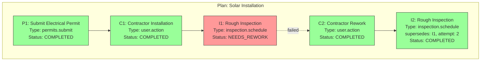

### Timeline

```mermaid
gantt
    title Solar Installation - Timeline
    dateFormat  YYYY-MM-DD
    
    section Permit
    P1: Submit Permit              :done, p1, 2026-01-10, 2026-01-15
    
    section Contractor Work
    C1: Contractor Installation    :done, c1, 2026-01-16, 2026-01-20
    
    section Inspection Chain
    I1: Rough Inspection           :crit, i1, 2026-01-21, 2026-01-25
    C2: Contractor Rework          :active, c2, 2026-01-26, 2026-02-01
    I2: Rough Inspection (retry)   :done, i2, 2026-02-02, 2026-02-10
```

### Step-by-Step Flow

#### 1. Permit Submitted and Approved

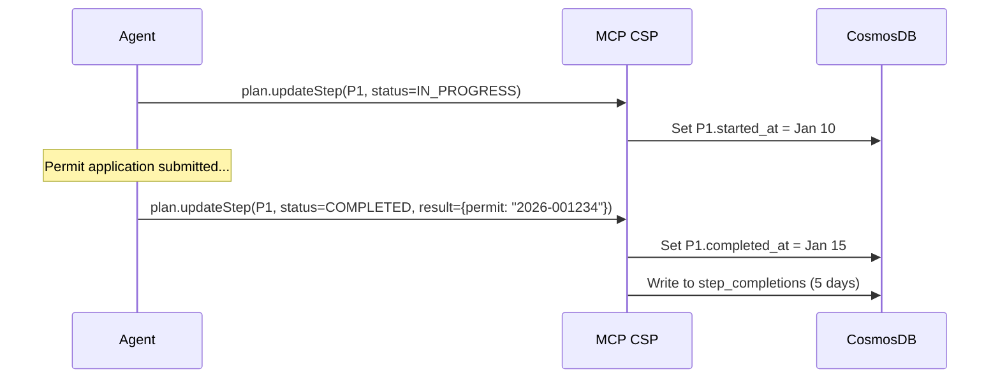

#### 2. Contractor Installation Completes

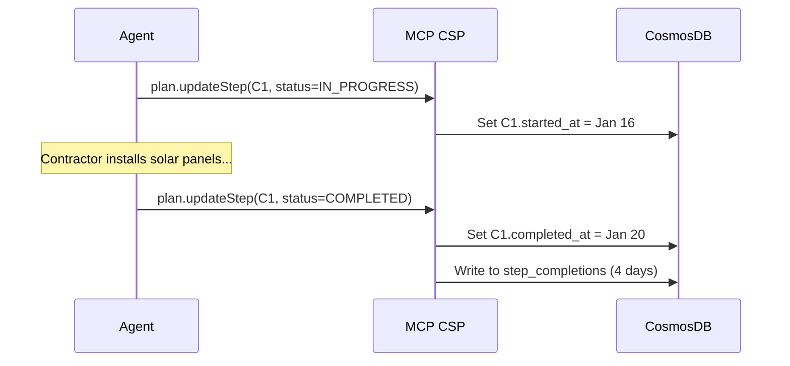

#### 3. Inspection Scheduled then Fails

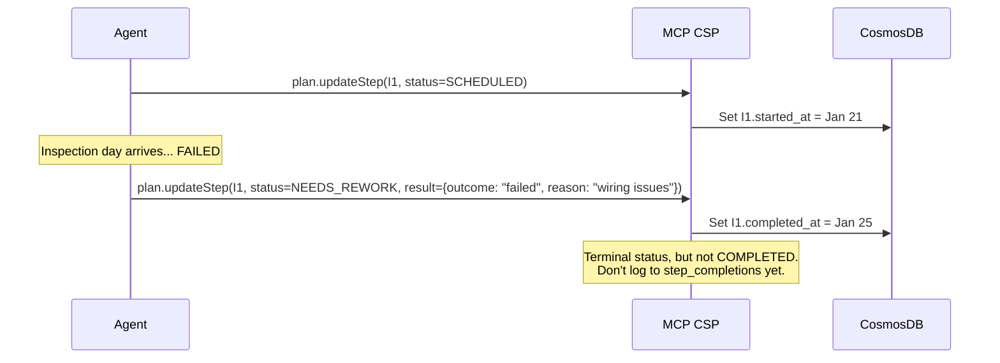

#### 4. Agent Creates Rework Steps

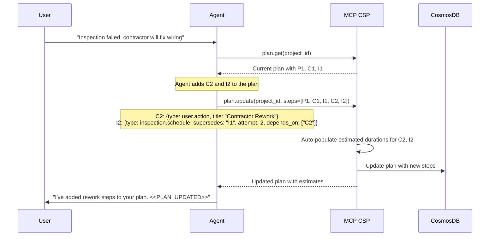

#### 5. Rework Completed, Re-Inspection Passes

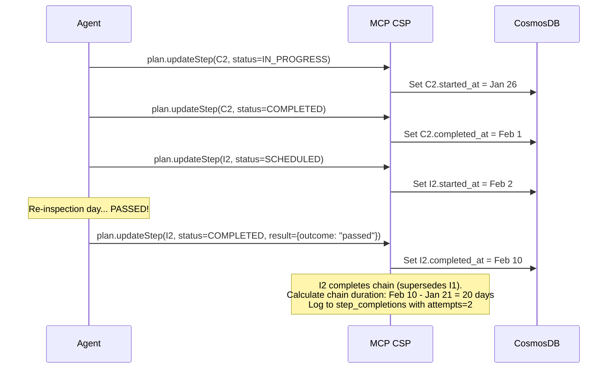

### Analytics Record

When `I2` completes, the `step_completions` record captures the full chain:

```json
{
  "id": "completion-uuid",
  "step_type": "inspection.schedule",
  "chain_started_at": "2026-01-21T00:00:00Z",
  "completed_at": "2026-02-10T00:00:00Z",
  "duration_days": 20,
  "attempts": 2
}
```

---

## UI Integration

### Plan Reload Signal

When the agent updates a plan via MCP CSP, it includes a signal in its chat response:

```
<<PLAN_UPDATED:project_id>>
```

The UI:
1. Detects this signal in the assistant message
2. Triggers a project component reload
3. Fetches fresh project data from API
4. Re-renders the plan widget

### Signal Flow

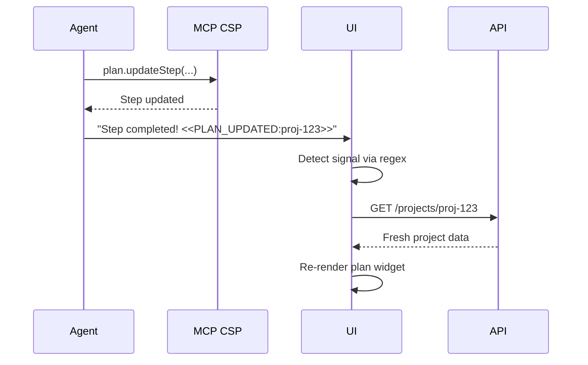

### Signal Alternatives Considered

| Option | Format | Decision |
|--------|--------|----------|
| Special token | `<<PLAN_UPDATED:uuid>>` | ✅ Selected — simple regex match |
| JSON block | ` ```signal {"type": "plan_updated"} ``` ` | ❌ Overkill |
| Metadata field | Message metadata object | ❌ Requires API changes |

---

## Infrastructure Updates

The following infrastructure changes are required:

### Bicep Templates

1. **Rename container app**: `aldelar-csp-mcp-reporting` → `aldelar-csp-mcp-csp`
2. **Update environment variables**: Rename `MCP_REPORTING_URL` → `MCP_CSP_URL`
3. **Update service references**: All references in agent and other services
4. **Update CosmosDB container**: Modify `step_completions` schema (remove TTL, add chain fields)

### Files to Update

| File | Changes |
|------|---------|
| `infra/main.bicep` | Rename service module reference |
| `infra/app/mcp-reporting.bicep` | Rename to `mcp-csp.bicep`, update resource names |
| `azure.yaml` | Update service name |
| `src/mcp-servers/reporting/` | Rename directory to `csp/` |
| `src/agents/csp-agent/` | Update MCP URL environment variable |
| `scripts/test-mcp-server.sh` | Update server name mappings |
| `Makefile` | Update target names (`test-reporting` → `test-csp`) |

---

## Migration Path

### Phase 1: Create MCP CSP (New Endpoints)
1. Rename `mcp-reporting` → `mcp-csp`
2. Add `plan.get`, `plan.create`, `plan.update`, `plan.updateStep` tools
3. Keep existing `steps.getAverageDuration`
4. Update `step_completions` schema for chain tracking

### Phase 2: Agent Integration
1. Update agent to use MCP CSP for plan operations
2. Update agent to emit `<<PLAN_UPDATED>>` signals
3. Update agent prompts for rework handling
4. Remove `json:plan` output format from agent

### Phase 3: UI Updates
1. Add signal detection for `<<PLAN_UPDATED>>`
2. Implement project component reload
3. Remove `json:plan` parsing logic
4. Update plan widget to show supersedes chains

### Phase 4: Cleanup
1. Deprecate `steps.logCompleted` (now automatic via `plan.updateStep`)
2. Update documentation

---

## Decisions Made

| Topic | Decision | Rationale |
|-------|----------|-----------|
| **Rework handling** | Agent creates new steps with `supersedes` link | Clear audit trail, accurate time tracking per attempt |
| **Terminal statuses** | `NEEDS_REWORK` and `REJECTED` are terminal | Original step preserved for history; new steps continue work |
| **Time tracking** | Chain-based (first start → final complete) | Reflects true end-to-end duration including rework |
| **Step types** | Action-based only (not status checks) | `getStatus` is an MCP tool, not a plan step |
| **Status expansion** | Added `SCHEDULED` and `REJECTED` | Different step types have different natural progressions |
| **Conflict resolution** | Last write wins | Concurrent updates unlikely; simplest approach |
| **Historical data bootstrap** | Return random 5-30 days when no data | Demo purposes; TODO: generate seeding data |
| **UI display of rework** | Sequential timeline (Option B) | Steps shown one after another, flow is clear from supersedes links |
| **Data retention** | No TTL on step_completions | Preserve analytics data forever |
| **Location filtering** | No city/location filter | Aggregate across all data; insufficient data to segment |
| **Step automation** | Boolean `automated` flag per step | Distinguishes agent-driven (MCP handles) vs user-driven (action card) |
| **Action cards** | Generated on IN_PROGRESS for non-automated steps | Stored in step, sent to user, UI handles completion trigger |

---

## Success Criteria

1. ✅ Agent can create and update plans via MCP tools (no chat-embedded JSON)
2. ✅ Step timing is automatically captured on status transitions
3. ✅ New plans show estimated durations based on historical data
4. ✅ UI refreshes plans reactively via signals
5. ✅ Rework scenarios create proper supersedes chains
6. ✅ Analytics capture chain duration for accurate averages

---

## Related Documents

- [2-spec-cosmosdb.md](../specs/2-spec-cosmosdb.md) — Database schemas
- [4-spec-csp-agent.md](../specs/4-spec-csp-agent.md) — Agent specification
- [9-proposal-enhanced-plan-tracking.md](9-proposal-enhanced-plan-tracking.md) — Enhanced step tracking
- [1-spec-mcp-servers.md](../specs/1-spec-mcp-servers.md) — MCP server patterns
