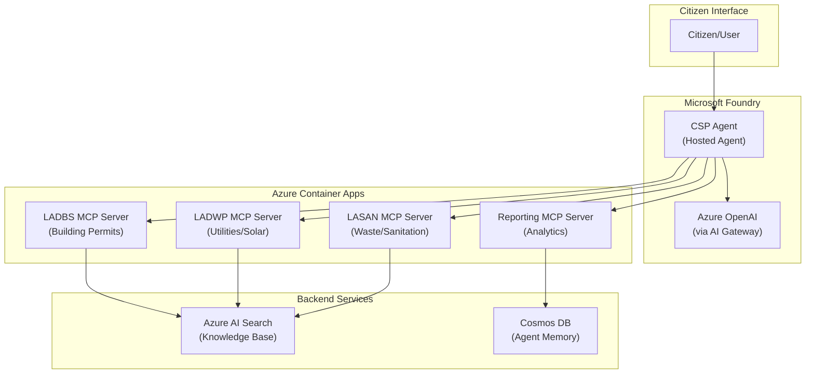

# CSP Agent Technical Specification

This document provides the comprehensive technical specification for the **CSP Agent** (Citizen Services Portal Agent), a single unified Hosted Agent deployed in Microsoft Foundry that connects to all MCP servers to provide intelligent citizen services.

---

## 1. Architecture Overview

### 1.1 Design Pattern

The CSP Agent follows the **Single Hosted Agent** pattern using the Microsoft Agent Framework. This approach provides:

- **Unified Entry Point**: One agent handles all citizen service requests
- **Cross-Agency Coordination**: Can create "Plans" spanning multiple agencies
- **Simplified Deployment**: Single agent to manage vs. multiple per-agency agents
- **Centralized Intelligence**: Holistic view of citizen needs across services

### 1.2 Architecture Diagram



### 1.3 Deployment Model

| Component | Hosting | Runtime |
|-----------|---------|---------|
| CSP Agent | Microsoft Foundry (Hosted Agent) | Docker Container via ACI |
| MCP Servers | Azure Container Apps | Python FastAPI |
| AI Models | Azure OpenAI | gpt-4.1-mini, gpt-4.1 |
| Knowledge Base | Azure AI Search | Vector + Semantic |

---

## 2. Agent Definition Structure

### 2.1 Folder Structure

```
/src/agents/csp-agent/
├── Dockerfile                    # Container definition for agent
├── README.md                     # Agent-specific documentation
├── agent.yaml                    # Agent manifest for Foundry
├── main.py                       # Agent entry point
├── requirements.txt              # Python dependencies
└── prompts/
    └── system_prompt.md          # Agent system instructions
```

### 2.2 File Descriptions

| File | Purpose |
|------|---------|
| `Dockerfile` | Builds the agent container image for deployment to Azure Container Instances |
| `agent.yaml` | Foundry agent manifest defining name, description, protocols, and environment variables |
| `main.py` | Main entry point that creates the agent with all MCP tools and runs it as a hosted agent |
| `requirements.txt` | Python package dependencies for the agent |
| `prompts/system_prompt.md` | Comprehensive system prompt defining agent behavior and capabilities |
| `README.md` | Documentation for developing, testing, and deploying the agent |

---

## 3. MCP Tool Integration

### 3.1 MCP Server Connections

The CSP Agent connects to four MCP servers, each providing specialized tools:

| MCP Server | Purpose | Key Tools |
|------------|---------|-----------|
| **LADBS** | Building & Safety | `queryKB`, `permits.search`, `permits.submit`, `permits.getStatus`, `inspections.schedule` |
| **LADWP** | Water & Power | `queryKB`, `account.show`, `plans.list`, `tou.enroll`, `interconnection.submit`, `rebates.apply` |
| **LASAN** | Sanitation | `queryKB`, `pickup.scheduled`, `pickup.schedule`, `pickup.getEligibility` |
| **Reporting** | Analytics | Cross-agency reporting and metrics |

### 3.2 Environment Variables for MCP URLs

```yaml
environment_variables:
  - name: MCP_LADBS_URL
    value: ${MCP_LADBS_URL}      # From SERVICE_MCP_LADBS_URI
  - name: MCP_LADWP_URL
    value: ${MCP_LADWP_URL}      # From SERVICE_MCP_LADWP_URI
  - name: MCP_LASAN_URL
    value: ${MCP_LASAN_URL}      # From SERVICE_MCP_LASAN_URI
  - name: MCP_REPORTING_URL
    value: ${MCP_REPORTING_URL}  # From SERVICE_MCP_REPORTING_URI
```

### 3.3 Tool Registration

Each MCP server is registered as a `HostedMCPTool`:

```python
from agent_framework import HostedMCPTool

tools = [
    HostedMCPTool(name="LADBS", url=os.environ["MCP_LADBS_URL"]),
    HostedMCPTool(name="LADWP", url=os.environ["MCP_LADWP_URL"]),
    HostedMCPTool(name="LASAN", url=os.environ["MCP_LASAN_URL"]),
    HostedMCPTool(name="Reporting", url=os.environ["MCP_REPORTING_URL"]),
]
```

---

## 4. Core Agent Capabilities

### 4.1 Plan Generation

The CSP Agent generates "Plans" for multi-agency coordination. A Plan is a structured workflow that guides citizens through complex service requests.

#### 4.1.1 Plan Model Schema

```python
from pydantic import BaseModel
from typing import List, Optional
from enum import Enum
from datetime import datetime

class AgencyCode(str, Enum):
    LADBS = "ladbs"
    LADWP = "ladwp"
    LASAN = "lasan"

class StepStatus(str, Enum):
    PENDING = "pending"
    IN_PROGRESS = "in_progress"
    AWAITING_USER_ACTION = "awaiting_user_action"
    COMPLETED = "completed"
    SKIPPED = "skipped"
    FAILED = "failed"

class ActionType(str, Enum):
    AUTOMATED = "automated"          # Agent can execute directly
    USER_ACTION = "user_action"      # User must take action (call, email, etc.)
    INFORMATION = "information"      # Information gathering step

class PlanStep(BaseModel):
    """A single step in a citizen service plan."""
    step_number: int
    title: str
    description: str
    agency: AgencyCode
    action_type: ActionType
    status: StepStatus = StepStatus.PENDING
    
    # Tool to invoke (if automated)
    tool_name: Optional[str] = None
    tool_parameters: Optional[dict] = None
    
    # Dependencies
    depends_on: List[int] = []        # Step numbers this depends on
    
    # Results
    result: Optional[dict] = None
    completed_at: Optional[datetime] = None
    notes: Optional[str] = None

class Plan(BaseModel):
    """A multi-step plan for citizen services."""
    plan_id: str
    title: str
    summary: str
    citizen_goal: str                  # What the citizen wants to achieve
    
    steps: List[PlanStep]
    current_step: int = 1
    
    created_at: datetime
    updated_at: datetime
    estimated_duration: str            # e.g., "4-6 weeks"
    
    # Agencies involved
    agencies_involved: List[AgencyCode]
    
    # Status tracking
    total_steps: int
    completed_steps: int = 0
    status: str = "in_progress"        # in_progress, completed, blocked
```

#### 4.1.2 Example Plan: Solar Installation

```json
{
  "plan_id": "PLAN-2026-001",
  "title": "Complete Solar PV Installation with Battery Storage",
  "summary": "Guide through permits, utility interconnection, and rebates for residential solar installation",
  "citizen_goal": "Install 8.5kW solar panels with 13.5kWh battery storage",
  
  "steps": [
    {
      "step_number": 1,
      "title": "Gather Requirements Information",
      "description": "Query knowledge bases for solar permit and interconnection requirements",
      "agency": "ladbs",
      "action_type": "automated",
      "tool_name": "queryKB",
      "depends_on": []
    },
    {
      "step_number": 2,
      "title": "Submit Electrical Permit Application",
      "description": "Submit permit application with required documents",
      "agency": "ladbs",
      "action_type": "automated",
      "tool_name": "permits.submit",
      "depends_on": [1]
    },
    {
      "step_number": 3,
      "title": "Enroll in TOU-D-PRIME Rate Plan",
      "description": "Enroll in time-of-use rate optimized for solar customers",
      "agency": "ladwp",
      "action_type": "automated",
      "tool_name": "tou.enroll",
      "depends_on": []
    },
    {
      "step_number": 4,
      "title": "Submit Interconnection Application",
      "description": "Apply for solar interconnection with LADWP",
      "agency": "ladwp",
      "action_type": "user_action",
      "tool_name": "interconnection.submit",
      "depends_on": [2]
    },
    {
      "step_number": 5,
      "title": "Schedule Rough Electrical Inspection",
      "description": "Schedule inspection after installation begins",
      "agency": "ladbs",
      "action_type": "user_action",
      "tool_name": "inspections.schedule",
      "depends_on": [2, 4]
    },
    {
      "step_number": 6,
      "title": "Dispose of Old HVAC Equipment",
      "description": "Schedule pickup for old AC unit and furnace being replaced",
      "agency": "lasan",
      "action_type": "user_action",
      "tool_name": "pickup.schedule",
      "depends_on": []
    }
  ],
  
  "agencies_involved": ["ladbs", "ladwp", "lasan"],
  "estimated_duration": "6-8 weeks",
  "total_steps": 6
}
```

### 4.2 Knowledge Base Querying

#### 4.2.1 Query Strategy

The agent uses `queryKB` tools to gather information before making recommendations:

1. **Initial Discovery**: When a citizen describes their goal, query relevant MCP servers
2. **Cross-Reference**: Combine results from multiple agencies for comprehensive guidance
3. **Context Building**: Store relevant KB results for use in plan generation

#### 4.2.2 Result Aggregation

```python
async def gather_requirements(goal: str) -> dict:
    """Gather requirements from relevant knowledge bases."""
    results = {}
    
    # Query each relevant MCP server
    if "permit" in goal.lower() or "construction" in goal.lower():
        results["ladbs"] = await ladbs_mcp.queryKB(goal)
    
    if "solar" in goal.lower() or "utility" in goal.lower() or "electric" in goal.lower():
        results["ladwp"] = await ladwp_mcp.queryKB(goal)
    
    if "disposal" in goal.lower() or "pickup" in goal.lower():
        results["lasan"] = await lasan_mcp.queryKB(goal)
    
    return synthesize_results(results)
```

### 4.3 Plan Execution

#### 4.3.1 Step-by-Step Guidance

The agent guides users through plans one step at a time:

1. **Present Current Step**: Explain what needs to happen
2. **Execute or Prepare**: For automated steps, execute; for user actions, prepare materials
3. **Collect Results**: Get confirmation or required information from user
4. **Advance Plan**: Move to next step(s) based on dependencies

#### 4.3.2 Handling UserActionResponse

When a tool returns `UserActionResponse`, the agent:

1. **Present Materials**: Show phone script, email draft, or checklist
2. **Explain Action**: Tell user what they need to do and why
3. **Wait for Completion**: Ask user to confirm when done
4. **Collect Information**: Gather required info (confirmation number, date, etc.)
5. **Update Plan**: Mark step complete and proceed

```python
# Example handling
if response.requires_user_action:
    # Present prepared materials
    print(f"ACTION REQUIRED: {response.action_type}")
    print(f"Contact: {response.target}")
    print(f"Reason: {response.reason}")
    
    if response.prepared_materials.phone_script:
        print(f"What to say: {response.prepared_materials.phone_script}")
    
    # Wait for user to complete
    # Ask on_complete.prompt to gather expected_info
```

### 4.4 Context Management

The agent maintains conversation context for multi-turn interactions:

- **Active Plan**: Current plan being executed (if any)
- **Citizen Profile**: Collected information (address, contact info, account numbers)
- **Step History**: Completed steps and their results
- **Pending Actions**: User actions that are pending completion

---

## 5. System Prompt Design

### 5.1 Prompt Structure

The system prompt (`prompts/system_prompt.md`) includes:

1. **Agent Identity**: Who the agent is and its role
2. **Available Tools**: Description of each MCP server and its capabilities
3. **Plan Framework**: How to generate and execute plans
4. **Response Guidelines**: Formatting and communication style
5. **Multi-Agency Rules**: How to coordinate across agencies

### 5.2 Key Prompt Sections

#### Identity Section
```markdown
You are the **Citizen Services Portal Agent (CSP Agent)**, an AI assistant for the City of Los Angeles. 
You help citizens navigate government services across multiple departments including:
- Building & Safety (LADBS)
- Water & Power (LADWP)
- Sanitation & Environment (LASAN)
```

#### Tools Section
```markdown
## Available Tools

### LADBS MCP Server (Building & Safety)
- `queryKB`: Search for permit requirements, fees, and processes
- `permits.search`: Find existing permits by address or number
- `permits.submit`: Submit new permit applications
- `permits.getStatus`: Check permit status
- `inspections.schedule`: Prepare inspection scheduling (requires user phone call)

### LADWP MCP Server (Water & Power)
- `queryKB`: Search for rate plans, rebates, and solar programs
- `account.show`: View account information
- `plans.list`: List available rate plans
- `tou.enroll`: Enroll in time-of-use rate plans
- `interconnection.submit`: Prepare solar interconnection application (requires user email)
- `rebates.apply`: Submit rebate applications

### LASAN MCP Server (Sanitation)
- `queryKB`: Search for disposal guidelines and recycling info
- `pickup.scheduled`: View scheduled pickups
- `pickup.schedule`: Prepare pickup scheduling (requires user 311 call)
- `pickup.getEligibility`: Check item eligibility for pickup
```

#### Plan Generation Rules
```markdown
## Plan Generation

When a citizen has a complex goal that spans multiple steps or agencies:

1. **Understand the Goal**: Ask clarifying questions if needed
2. **Query Knowledge Bases**: Use queryKB tools to gather requirements
3. **Generate Plan**: Create a structured plan with numbered steps
4. **Present Plan**: Show the citizen the complete plan with estimates
5. **Execute Step-by-Step**: Guide through each step, collecting information as needed

Plans should:
- Group related steps by agency when possible
- Identify dependencies between steps
- Distinguish automated vs. user-action steps
- Provide realistic time estimates
```

---

## 6. Configuration

### 6.1 Required Environment Variables

| Variable | Description | Source |
|----------|-------------|--------|
| `AZURE_OPENAI_ENDPOINT` | Azure OpenAI endpoint URL | Foundry Project AI Gateway |
| `AZURE_OPENAI_CHAT_DEPLOYMENT_NAME` | Chat model deployment name | e.g., `gpt-4o-mini` |
| `MCP_LADBS_URL` | LADBS MCP server URL | `SERVICE_MCP_LADBS_URI` from azd |
| `MCP_LADWP_URL` | LADWP MCP server URL | `SERVICE_MCP_LADWP_URI` from azd |
| `MCP_LASAN_URL` | LASAN MCP server URL | `SERVICE_MCP_LASAN_URI` from azd |
| `MCP_REPORTING_URL` | Reporting MCP server URL | `SERVICE_MCP_REPORTING_URI` from azd |

### 6.2 agent.yaml Configuration

```yaml
# yaml-language-server: $schema=https://raw.githubusercontent.com/microsoft/AgentSchema/refs/heads/main/schemas/v1.0/ContainerAgent.yaml

kind: hosted
name: csp-agent
description: |
    Citizen Services Portal Agent - A unified AI assistant for City of Los Angeles 
    government services. Connects to LADBS (Building & Safety), LADWP (Water & Power), 
    LASAN (Sanitation), and Reporting MCP servers to provide intelligent citizen services 
    with multi-agency coordination.

metadata:
    authors:
        - Citizen Services Portal Team
    tags:
        - Azure AI AgentServer
        - Microsoft Agent Framework
        - Model Context Protocol
        - MCP
        - Citizen Services
        - Government

protocols:
    - protocol: responses
      version: ""

environment_variables:
    - name: AZURE_OPENAI_ENDPOINT
      value: ${AZURE_OPENAI_ENDPOINT}
    - name: AZURE_OPENAI_CHAT_DEPLOYMENT_NAME
      value: ${AZURE_OPENAI_CHAT_DEPLOYMENT_NAME}
    - name: MCP_LADBS_URL
      value: ${MCP_LADBS_URL}
    - name: MCP_LADWP_URL
      value: ${MCP_LADWP_URL}
    - name: MCP_LASAN_URL
      value: ${MCP_LASAN_URL}
    - name: MCP_REPORTING_URL
      value: ${MCP_REPORTING_URL}
```

---

## 7. Deployment

### 7.1 Docker Build

The agent is containerized using the following Dockerfile:

```dockerfile
FROM python:3.12-slim

WORKDIR /app

COPY . user_agent/
WORKDIR /app/user_agent

RUN if [ -f requirements.txt ]; then \
        pip install -r requirements.txt; \
    else \
        echo "No requirements.txt found"; \
    fi

EXPOSE 8088

CMD ["python", "main.py"]
```

### 7.2 Deployment Commands

Deploy the CSP Agent using the Azure Developer CLI with the AI agent extension:

```bash
# Navigate to agent directory
cd src/agents/csp-agent

# Export MCP server URLs from azd environment
export MCP_LADBS_URL=$(azd env get-value SERVICE_MCP_LADBS_URI)
export MCP_LADWP_URL=$(azd env get-value SERVICE_MCP_LADWP_URI)
export MCP_LASAN_URL=$(azd env get-value SERVICE_MCP_LASAN_URI)
export MCP_REPORTING_URL=$(azd env get-value SERVICE_MCP_REPORTING_URI)

# Build and deploy the agent
azd ai agent build
azd ai agent deploy
```

### 7.3 Full Deployment via azd

The agent is deployed automatically via the `postdeploy` hook in `azure.yaml`:

```yaml
postdeploy:
  posix:
    shell: sh
    run: |
      echo "Deploying CSP Agent to Microsoft Foundry..."
      cd src/agents/csp-agent
      
      # Export required environment variables
      export foundryProjectEndpoint=$(azd env get-value foundryProjectEndpoint)
      export AZURE_SUBSCRIPTION_ID=$(azd env get-value AZURE_SUBSCRIPTION_ID)
      export resourceGroupName=$(azd env get-value resourceGroupName)
      export foundryName=$(azd env get-value foundryName)
      export foundryProjectName=$(azd env get-value foundryProjectName)
      
      # Export MCP server URLs
      export MCP_LADBS_URL=$(azd env get-value SERVICE_MCP_LADBS_URI)
      export MCP_LADWP_URL=$(azd env get-value SERVICE_MCP_LADWP_URI)
      export MCP_LASAN_URL=$(azd env get-value SERVICE_MCP_LASAN_URI)
      export MCP_REPORTING_URL=$(azd env get-value SERVICE_MCP_REPORTING_URI)
      
      # Deploy using azd ai agent extension
      azd ai agent build
      azd ai agent deploy
```

### 7.4 Testing and Validation

#### Local Testing

```bash
# Set environment variables
export AZURE_OPENAI_ENDPOINT="https://your-openai-resource.openai.azure.com/"
export AZURE_OPENAI_CHAT_DEPLOYMENT_NAME="gpt-4o-mini"
export MCP_LADBS_URL="http://localhost:8001"
export MCP_LADWP_URL="http://localhost:8002"
export MCP_LASAN_URL="http://localhost:8003"
export MCP_REPORTING_URL="http://localhost:8004"

# Install dependencies
pip install -r requirements.txt

# Run the agent locally
python main.py
```

#### Testing the Deployed Agent

```bash
# Test via curl
curl -sS -H "Content-Type: application/json" \
  -X POST http://localhost:8088/responses \
  -d '{"input": "I want to install solar panels on my home", "stream": false}'
```

---

## 8. Comparison: Single Agent vs Multi-Agent Approach

### 8.1 Current Approach (MVP)

| Aspect | Single CSP Agent |
|--------|------------------|
| **Deployment** | One hosted agent in Foundry |
| **Maintenance** | Simpler - one codebase |
| **Coordination** | Built-in multi-agency plans |
| **Scalability** | Scales via container replicas |
| **Use Case** | MVP and most citizen requests |

### 8.2 Future Approach (Reserved)

The `_future_approach` folder contains per-agency agent implementations that may be used for:

- **Specialized Expertise**: Deep agency-specific knowledge
- **Independent Scaling**: Scale agencies independently
- **Organizational Alignment**: Match agency boundaries
- **Advanced Orchestration**: Multi-agent collaboration patterns

---

## 9. Acceptance Criteria

- [ ] `/specs/4-spec-csp-agent.md` is comprehensive and implementation-ready
- [ ] `/src/agents/csp-agent/` folder is created with all required files
- [ ] Agent connects to all 4 MCP servers successfully
- [ ] System prompt properly defines Plan generation and execution behavior
- [ ] `/README.md` accurately reflects new architecture
- [ ] `_future_approach` folder is documented as reserved for future use
- [ ] `azure.yaml` postdeploy hook deploys CSP Agent (not old agents)
- [ ] All existing MCP server deployments continue to work unchanged
- [ ] Agent can be deployed via `azd up` or `azd deploy`
