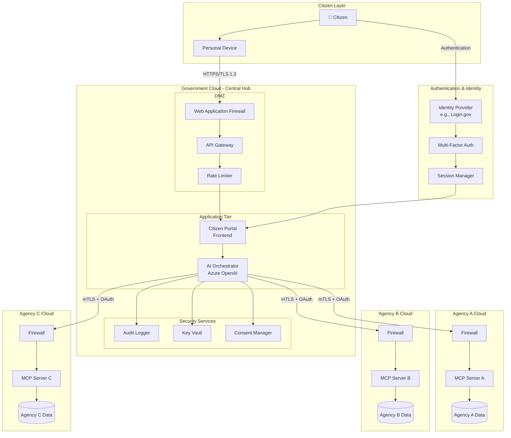
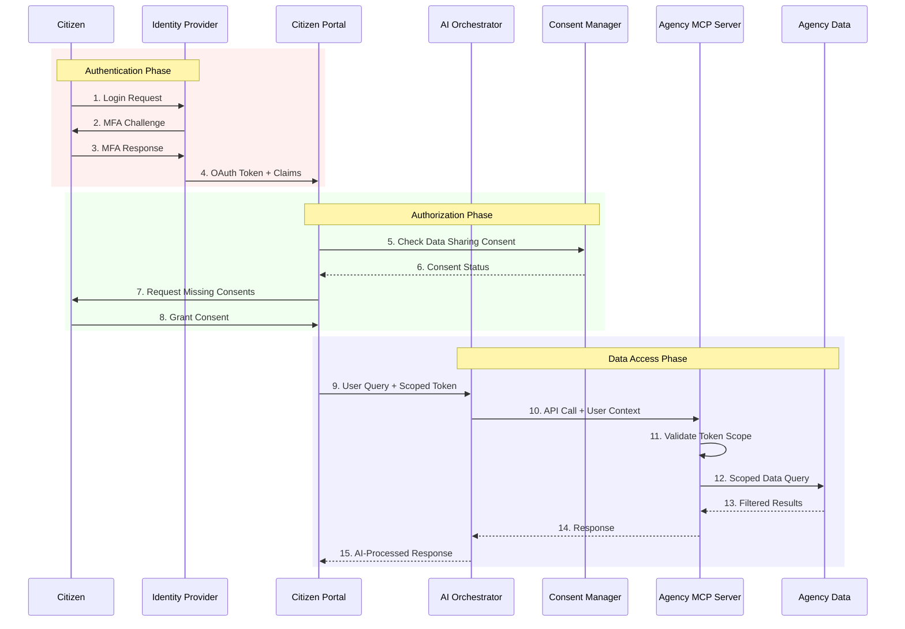
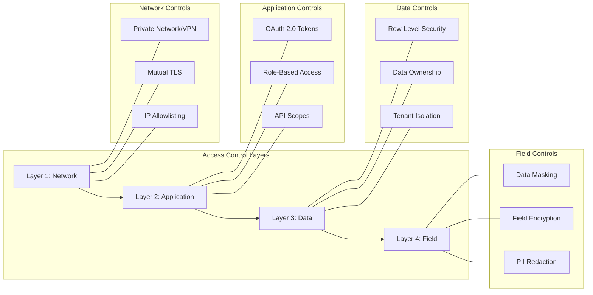
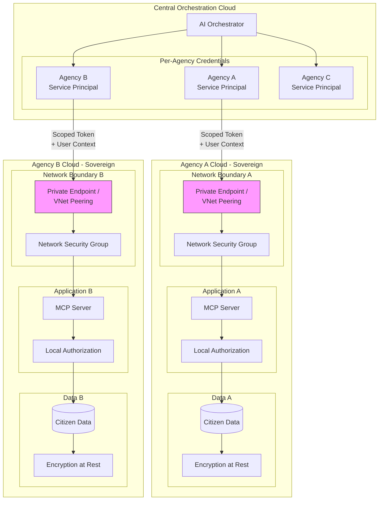
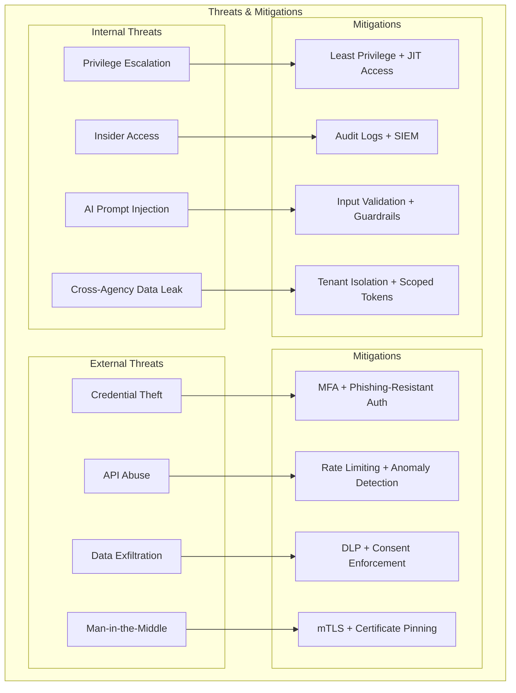
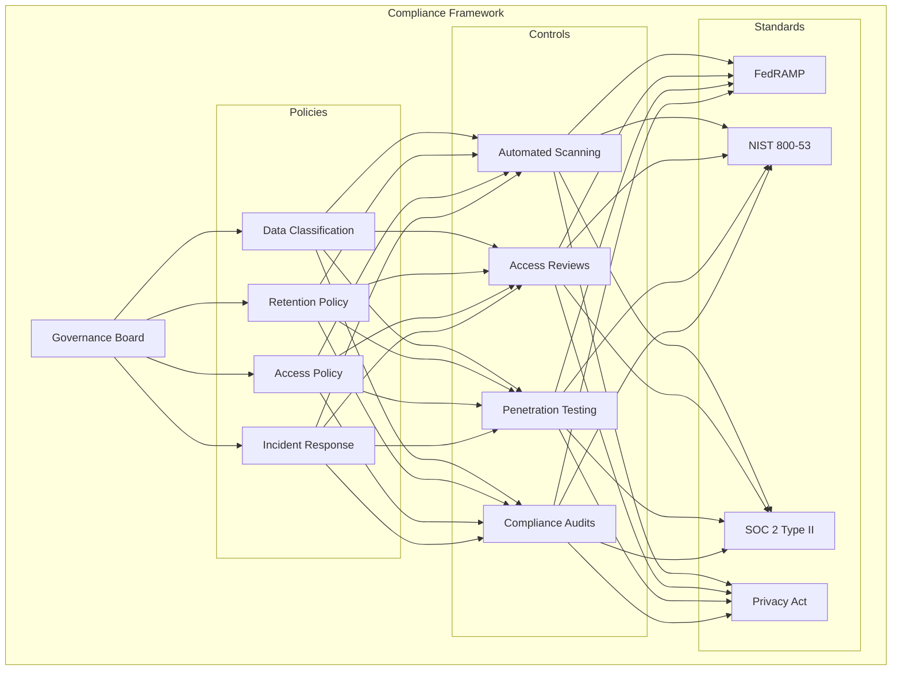

# Security Specification

This document articulates the security considerations for a real-life deployment of the Citizen Services Portal, where each agency operates in its own sovereign cloud environment.

---

## 1. High-Level Security Architecture

### Key Architectural Principles

- **Centralized Orchestration**: The AI orchestrator lives in a central government cloud and coordinates across agencies
- **Sovereign Agency Clouds**: Each agency maintains full control of their data and infrastructure
- **Defense in Depth**: Multiple security layers from edge (WAF) to data (encryption at rest)
- **Zero Trust Network**: All inter-cloud communication authenticated and encrypted

---

## 2. Authentication & Authorization Flow

### Authentication Requirements

| Component | Requirement | Implementation |
|-----------|-------------|----------------|
| Citizen Identity | Federated identity with government IdP | Login.gov, Azure AD B2C |
| MFA | Mandatory for all citizen access | TOTP, FIDO2, SMS backup |
| Session Management | Short-lived tokens, secure refresh | 15-min access tokens, 8-hr refresh |
| Service Identity | Managed identities for inter-service | Azure Managed Identity, Workload Identity |

---

## 3. Data Access Control Layers

### Layer Details

| Layer | Purpose | Key Controls |
|-------|---------|--------------|
| **Network** | Prevent unauthorized network access | Private endpoints, mTLS, IP allowlisting |
| **Application** | Validate identity and permissions | OAuth tokens, RBAC, API scopes |
| **Data** | Ensure data isolation | Row-level security, tenant isolation |
| **Field** | Protect sensitive fields | Encryption, masking, PII redaction |

---

## 4. Agency Isolation Model

### Agency Isolation Principles

- **Data Sovereignty**: Each agency's data never leaves their cloud boundary
- **Independent Authorization**: Each agency enforces its own access policies
- **Scoped Service Principals**: Central orchestrator has limited, scoped access per agency
- **Private Connectivity**: No data traverses public internet between clouds

---

## 5. Network Security Requirements

| Component | Requirement | Implementation |
|-----------|-------------|----------------|
| Public Edge | WAF with OWASP ruleset | Azure Front Door, AWS WAF |
| Inter-Cloud | Private connectivity, no public internet | VNet Peering, Private Link, Express Route |
| Agency Boundary | Zero-trust network access | NSG, Firewall, mTLS |
| Encryption in Transit | TLS 1.3 minimum | Certificate management via Key Vault |

---

## 6. Data Protection Requirements

| Component | Requirement | Implementation |
|-----------|-------------|----------------|
| Encryption at Rest | AES-256 for all data stores | Platform-managed or CMK |
| PII Handling | Minimize exposure, mask in logs | Field-level encryption, redaction |
| Data Residency | Agency data stays in agency cloud | No cross-cloud data replication |
| Backup Security | Encrypted, access-controlled backups | Geo-redundant with RBAC |

---

## 7. Authorization & Consent Requirements

| Component | Requirement | Implementation |
|-----------|-------------|----------------|
| Citizen Consent | Explicit opt-in for data sharing | Consent service with versioning |
| Scope Limitation | Minimum necessary data access | OAuth scopes per agency/data type |
| Row-Level Security | Citizens see only their data | User context in every API call |
| Audit Trail | Complete access logging | Immutable audit logs, 7-year retention |

---

## 8. Threat Model

### Threat Summary

| Threat Category | Example Attacks | Mitigations |
|-----------------|-----------------|-------------|
| **Credential Theft** | Phishing, credential stuffing | MFA, phishing-resistant auth (FIDO2) |
| **API Abuse** | DDoS, enumeration attacks | Rate limiting, anomaly detection |
| **Data Exfiltration** | Unauthorized bulk export | DLP policies, consent enforcement |
| **Man-in-the-Middle** | TLS interception | mTLS, certificate pinning |
| **Privilege Escalation** | Token manipulation | Least privilege, JIT access |
| **Insider Threats** | Unauthorized data access | Audit logs, SIEM monitoring |
| **Prompt Injection** | Malicious AI inputs | Input validation, AI guardrails |
| **Cross-Agency Leak** | Data mixing between agencies | Tenant isolation, scoped tokens |

---

## 9. AI-Specific Security Controls

```mermaid
flowchart LR
    subgraph "AI Security Controls"
        direction TB
        
        subgraph "Input Protection"
            IP1[Prompt Injection Detection]
            IP2[Input Sanitization]
            IP3[Context Window Limits]
        end
        
        subgraph "Processing Protection"
            PP1[No PII in Training]
            PP2[Grounded Responses Only]
            PP3[Tool Call Validation]
        end
        
        subgraph "Output Protection"
            OP1[Response Filtering]
            OP2[Citation Requirements]
            OP3[Confidence Thresholds]
        end
    end

    USER[User Query] --> IP1 --> IP2 --> IP3
    IP3 --> PP1 --> PP2 --> PP3
    PP3 --> OP1 --> OP2 --> OP3 --> RESPONSE[Safe Response]
```

### AI Orchestrator Security Requirements

| Concern | Requirement | Implementation |
|---------|-------------|----------------|
| Prompt Injection | Detect and block malicious prompts | Azure AI Content Safety, custom filters |
| Data Leakage | AI cannot expose other citizens' data | User context isolation, scoped tool calls |
| Hallucination | Responses must be grounded in real data | RAG with citations, confidence scores |
| Audit | All AI interactions logged | Conversation logging with user consent |

### MCP Tool Security

- **Tool Allowlisting**: Only pre-approved tools can be invoked
- **Parameter Validation**: All tool parameters validated before execution
- **User Context Propagation**: Every tool call includes authenticated user context
- **Result Filtering**: Tool results filtered based on user permissions

---

## 10. Compliance & Governance

### Applicable Compliance Standards

| Standard | Scope | Key Requirements |
|----------|-------|------------------|
| **FedRAMP** | Federal cloud services | Continuous monitoring, authorization |
| **NIST 800-53** | Security controls | Control families, security assessment |
| **SOC 2 Type II** | Service organization | Trust principles, audit reports |
| **Privacy Act** | Citizen data | Data minimization, consent, access rights |

### Governance Requirements

- **Data Classification**: All data classified by sensitivity level
- **Retention Policies**: Automated enforcement of data retention
- **Access Reviews**: Quarterly review of all privileged access
- **Incident Response**: Documented procedures with SLAs

---

## 11. Summary: Core Security Principles

| Principle | Description |
|-----------|-------------|
| **Zero Trust** | Never trust, always verify. Every request authenticated and authorized. |
| **Data Sovereignty** | Each agency maintains full control of their data in their cloud. |
| **Least Privilege** | Minimum access required for each operation. |
| **Defense in Depth** | Multiple security layers at network, application, and data levels. |
| **Consent-Driven** | Citizens explicitly control what data is shared. |
| **Audit Everything** | Complete traceability of all data access. |
| **Encryption Everywhere** | Data encrypted in transit and at rest. |
| **AI Guardrails** | Special controls for AI-generated content and tool execution. |

---

## 12. Implementation Checklist

### Phase 1: Foundation
- [ ] Implement federated identity with government IdP
- [ ] Deploy WAF and API Gateway
- [ ] Establish private connectivity between clouds
- [ ] Configure Key Vault for secrets management

### Phase 2: Access Control
- [ ] Implement OAuth 2.0 with scoped tokens
- [ ] Deploy consent management service
- [ ] Configure row-level security in databases
- [ ] Set up audit logging infrastructure

### Phase 3: AI Security
- [ ] Deploy AI Content Safety filters
- [ ] Implement prompt injection detection
- [ ] Configure tool call validation
- [ ] Set up AI interaction logging

### Phase 4: Compliance
- [ ] Complete security control documentation
- [ ] Conduct penetration testing
- [ ] Perform compliance audit
- [ ] Establish continuous monitoring
